# 🐢⚡ KAME Version Evolution — Complete History

Every release, newest first. Each one opens with **In short** — the whole
release as a handful of lines — and folds the reasoning, the logs it came from
and the verification underneath, so this page reads as a list of releases
rather than as a wall of prose.

---

## 📌 At a glance

| Version | Headline | What changed for you |
|---|---|---|
| **1.6.0.4** | A thinking token is not an answer | The flag meaning *"the model has streamed something"* gates two things here, and both are about the **answer**: whether an empty result may be retried on another key, and whether the log may say a drop happened *after partial output*. `reasoning_callback` was setting it. A model that thinks and then returns nothing is exactly the empty answer this carousel exists to rotate around — Gemini spending its whole budget on thoughts is the textbook case — so the retry was switched off on precisely the models that need it, and the warning told you your answer had been cut when nothing had been shown. Thoughts are now recorded apart from output. Found in the Hermes port, where the same confusion had a worse consequence: it stopped the rotation outright and ended two turns with thirteen healthy keys idle in the pool |
| **1.6.0.3** | The provider names the window, and the provider names the wait | Google reports its per-minute and per-day free-tier quotas under the **identical** metric name and separates them only in `quotaId` — a field this engine already extracted, for a log tag, while the actual daily-or-not decision was made by searching the whole message for the word "day". A host that appends *"a few hundred requests/day"* to the sentence was enough to turn a 40-second throttle into an hour on the bench. The quota id now decides, in both directions. Alongside it, two numbers that were being invented over numbers the provider had stated: the per-minute branch raised a floor of 20s, 40s, 80s … from the second refusal, over whatever Google had asked for — repeating a throttle is not evidence the provider lied, it is what a rolling window does — and `_extract_retry_delay` read only `str(exc)`, so on a Gemini 429 it returned its 20-second default while `"retryDelay": "41.3s"` sat in the response body, three lines from the `quotaId` this same file reads from exactly there. Every rest is now a number somebody measured: what the provider said for this refusal, what it said for an earlier one on the same model, or a flat re-probe — never a curve |
| **1.6.0.1** | A refusal is not a clock, and the rotation is on the screen | A live indicator beside the composer says how many keys can answer right now; a bare 401 rests twenty seconds instead of an hour and leaves rotation after three; a key the provider names dead leaves at once; and a 403 refusing **one model** never costs you the key |
| **1.2.0** | The wait, said out loud | An all-keys-cooling wait now says so in the chat, and the settings screen admits its settings are not equally interesting |
| **1.0.9** | Agent Zero makes the call | KAME only *chooses* the key — the request, stream and parsing go back to the host, so an A0 release stops breaking rotation |
| **1.0.8** | Stop when asked, quarantine when denied | Honors A0's early-stop contract; a permanently denied key is benched instead of retried |
| **1.0.7** | Response Shield | Heals empty `response`-tool arguments that crashed the host with `KeyError: 'message'` |
| **1.0.6** | Faster failover, honest numbers | Quicker recovery, verifiable quota logging, gentler empty-stream handling, invalid keys made visible |
| **1.0.5** | Daily quota, correctly | Daily-quota logic fixed, and the chat pauses instead of burning requests |
| **1.0.4** | Alive on Agent Zero V2 | A0 went 1.2 → V2.0 → V2.1 and moved the model entry point; one engine now serves both majors |
| **1.0.3** | Observability | Full raw errors on request, precise durations, storm-log collapse, invalid-key rotation. Selection path untouched |
| **1.0.2** | A 5xx is not a daily quota | A transient server error could cool the entire pool for an hour. It cannot any more |
| **1.0.1** | Quotas across providers | Daily-quota and account-limit awareness, plus a full log overhaul |
| **1.0.0** | First stable release | Production-validated, with zero engine changes from v0.5.8.0 |

Everything below **v1.0.0** is the pre-stable history, kept in full for anyone
tracing why a decision was made.

```mermaid
graph LR
    A["v0.4.1<br/>The Seed"] --> B["v0.4.4<br/>The Shield"]
    B --> C["v0.4.5<br/>The Surgeon"]
    C --> D["v0.4.6<br/>The Sentinel"]
    D --> E["v0.4.7<br/>The Orchestrator"]
    E --> F["v0.4.9<br/>The Strategist"]
    F --> G["v0.5.0<br/>The Commander"]
    G --> H["v0.5.1<br/>Log Honesty"]
    H --> I["v0.5.2<br/>Full Speed"]
    I --> J["v0.5.3<br/>The Speedster"]
    J --> K["v0.5.4<br/>The Zenith"]
    K --> L["v0.5.6<br/>The Trust"]
    L --> M["v0.5.7"]
    M --> N["v1.0.0<br/>First stable"]
    N --> O["v1.0.9<br/>Delegation"]
    O --> P["v1.2.0<br/>Current"]
    style P fill:#2ecc71,color:#fff
```



> Note: from v0.5.7 onward, releases are plain semver without codenames.

---

## v1.6.0.4 — current

**A thinking token is not an answer.**

`ctx["progress"]["any"]` means *the model streamed something*, and the carousel
spends it on two questions that are both about the **answer**:

* `_empty_budget > 0 and not ctx["progress"]["any"]` — may an empty result be
  retried on another key, or did a healthy key deliberately answer with nothing?
* the `mid-stream drop after partial output` warning — was any of the answer
  already on screen when the stream died?

`reasoning_callback` was setting that flag. On a thinking model it fires every
turn, before the answer exists, so both questions were answered wrongly on
every turn:

| Case | Before | After |
|---|---|---|
| model thinks, then returns nothing | returned to A0 as a deliberate blank answer | retried on the next key |
| model thinks, then the stream drops | "mid-stream drop after partial output" | rotates quietly, nothing was output |
| model streams text, then drops | correct | unchanged |

The first row is the one that matters. A model that reasons and then returns
nothing *is* the empty answer this loop exists to rotate around — Gemini
consuming its whole budget on thoughts is the textbook case — so the rotation
was switched off on exactly the models that need it.

Thoughts now record `ctx["progress"]["reasoning"]`, which nothing gates on. It
is kept because a reader of the ctx should still be able to tell a silent model
from a thinking one, and because deleting the signal entirely would have made
the next person re-derive why it was ever there.

### Where it came from

The Hermes port, measured on the owner's machine on 2026-09-04. There the same
confusion had a worse consequence: the flag also decides whether a drop may be
retried at all (retrying after visible text would print the answer twice), so
two turns out of a twelve-minute run ended with a 503 while thirteen healthy
keys sat idle. Hermes' own log for both says *"Streaming failed **before**
delivery"*. Agent Zero never had that consequence — its carousel rotates every
non-terminal failure regardless of the flag — which is why this is the smaller
half of one release. See PARITY.md.

### Verification

- 13 test scripts green, including `tests/test_v1_6_0_4.py` (17 checks).
- Mutation: the reasoning shim restored to `progress["any"] = True`, red.

---

## v1.6.0.3

**The provider names the window, and the provider names the wait.**

Two rules, one sentence: KAME never invents a number when the provider has
stated one, and never invents a window when the provider has named one. Both
came out of measurement, not out of reasoning about how providers ought to
behave.

### Where the measurement came from

The Hermes port of this plugin ran 46 minutes against Gemini on 2026-09-03 and
collected 340 refusals. Every one that carried a number carried a freshly
computed one:

| | |
|---|---|
| shortest Google asked for | 1.5s |
| median | 41.1s |
| **longest** | **59.8s** |

That port held keys for five minutes on ten of them. The two ports had the
same defect in different arithmetic — Hermes *multiplied* the stated number,
this engine raised a *floor* over it — and both are removed in this release.

### The quota id was a log tag, and it should have been the decision

Google reports both free-tier quotas under the identical metric name,
`generativelanguage.googleapis.com/generate_content_free_tier_requests`, and
separates them only here:

| quotaId | what it means |
|---|---|
| `GenerateRequestsPerMinutePerProjectPerModel-FreeTier` | seconds |
| `GenerateRequestsPerDayPerProjectPerModel-FreeTier` | the rest of the day |

`_extract_quota_marker` has read that field since v1.0.6 — to print a tag in
the log. The decision was made by `_is_daily_or_account_limit`, which searches
the **whole** message for `"daily"`, `"per day"`, `"/day"` or `"rpd"`. Its
docstring calls that strict, reasoning that a per-minute message cannot
contain those words.

It can. A host may append its own prose to the provider's sentence — Hermes
welds *"a few hundred requests/day for Gemini Flash models"* onto every
free-tier 429 — and a quota list may name several counters while violating
one. Either way a per-minute throttle was read as a spent day and a healthy
key sat out an hour for it. There is a test in `tests/test_v1_6_0_3.py` that
asserts the old heuristic is fooled by exactly that footer.

**`_quota_window_from_id` now decides, from the provider's own field alone,
and in both directions**: a `PerMinute` id means this is not daily whatever
the prose says, and a `PerDay` id means it is daily even when the prose is
silent. The substring heuristic keeps its job for every provider that files no
id at all, which is most of them.

The other direction is why this engine learned to distrust `retryDelay` in the
first place, back in v1.0.5. Google's own forum thread shows a daily quota of
250 requests exhausted, arriving with `retryDelay: "1s"`. That rule was always
right; until now it had no reliable way to know it was looking at a daily cap.

### Two numbers invented over numbers the provider had stated

**The per-minute floor.** From the second refusal on, this branch applied
`max(delay, 20 × 2ⁿ)` — 20s, 40s, 80s, capped at 300s. `applied` starts as the
classifier's number, so a provider asking for 41s and refusing four times in a
row was held for 80: a number nobody stated, over one that was.

Repeating a throttle is not evidence that the provider lied. On a rolling
window it is the ordinary case — the key is asked again while its window is
still full, and the provider recomputes and answers correctly again.
Escalating on that reads a restatement as a refutation. The streak is still
counted, because the reports read it and a key failing five times in a row is
worth seeing, but it no longer sizes anything the provider already sized.

**The delay that was sitting in the response body.** `_extract_retry_delay`
parsed only `str(exc)`. Every other reader in that file moved to
`_evidence_text` — which reads `exc.response.text` — when it turned out that
adapters spend the body and leave the provider's fields reachable only
through the parsed payload. The one reader whose entire job is to find the
number was left behind. On a Gemini 429 that meant returning the 20-second
default, and reporting the source as `default`, while `"retryDelay": "41.3s"`
sat in the response three lines from a `quotaId` this same file reads from
exactly there. The tally recorded *"the provider said nothing"* about a
refusal in which the provider had said precisely how long.

### What a throttle rests for now

| what is known | what the key rests for |
|---|---|
| the provider sized *this* refusal | exactly that |
| it sized an earlier one on this `provider:model` | that number |
| it has never sized one at all | the flat 20s default |

There is no ladder between them, and that is deliberate: a rate limit is a
rolling window — seconds, and the provider tells you — or a daily cap, which
is hours under a different counter with a different name. No provider
documents "come back in five minutes", so a curve from 20s to 300s spent its
whole range interpolating between regimes that do not meet.

The middle row is new (`_KAME_STATED_RL`) and it is what the terse refusal
needed. Google sends two wordings for the same condition: spelled out with
`Please retry in Ns`, and terse — `Resource has been exhausted (e.g. check
quota).` — with nothing. In that 46-minute run, 168 arrived spelled out and
232 arrived terse. A daily-length number is refused as a teacher, because on
Gemini a daily cap classifies as a throttle too and arrives sized at an hour.

Erring short is the deliberate half: a rest that is too short costs one
request that fails in milliseconds, and one that is too long costs a healthy
key for its whole duration, silently.

### Verification

| gate | result |
|---|---|
| all 12 test scripts | pass, including 18 new checks in `tests/test_v1_6_0_3.py` |
| mutation | 6 rules broken one at a time; **all 6 turn the suite red** |

The Hermes port ships the same rules in the same release. See `PARITY.md`.

---

## v1.6.0.1

**A refusal is not a clock, and the rotation is finally on the screen.**

Agent Zero **v2.11** shipped a week before this release and opened three doors
this plugin has wanted since it was born: `@extensible` on the model entry
points *and* on `models.get_api_key`, WebUI plugin slots beside the composer,
and plugin-contributed slash commands. Two of the three are used here.

*(There is no Agent Zero 1.3, 1.4 or 1.5, and no 1.6.0.0. The version line is
shared with the Hermes port at MAJOR.MINOR and the PATCH digit is free —
`PARITY.md` forbids padding releases to make digits meet, which is also why
there was no 1.1.x. All four digits are carried here so the two products read
as one release; Agent Zero never shipped a 1.6.0.0.)*

**In short**

- **The rotation is visible.** A ring beside the composer reads `12/14`, and a
  click opens every pool: what is ready, what is resting, what left rotation.
- **A refusal costs twenty seconds, not an hour** — and a refused key is offered
  last, never first.
- **A key the provider names dead leaves rotation.** A bare 401 does not, until
  three in a row.
- **A 403 refusing one model never costs the key**, which is the expensive one
  to get wrong.
- **`/kame` and `/kame doctor`** answer from inside the running process.
- The pool stops counting keys your config no longer declares.
- `key_log_style: full` is gone.
- Verified against Agent Zero **v2.11**.

<details>
<summary><b>Everything in this release, in detail</b></summary>

### Why you never saw the rotation

The only thing this plugin ever put on screen was the wait notice, and it is
gated three ways: the **whole pool** cold for **ninety seconds**, reached only
from the exhaustion sleep, and silently disabled for the rest of a call if
`context.log` ever throws. With fourteen keys that state is rare and short — so
in practice nothing appeared, and the reasonable conclusion was that nothing was
working.

Three surfaces now, each answering a different question:

| Surface | Answers | When |
|---|---|---|
| **The ring beside the composer** | *can it answer me right now* | always |
| **A live notification** | *what is it waiting for* | from ~15s into a wait |
| **The welcome banner** | *is there something I have to do* | only for retired credentials |

The ring reads **ready over total**, not healthy over total. A key resting
twenty seconds off a throttle is perfectly healthy and cannot take this turn,
and conflating the two is how a panel ends up reassuring somebody whose agent is
stuck. Click it and every `provider:model` pool is there — keys ready, resting,
left rotation, and when the next one comes back.

The composer **placeholder** was considered for this, because that is where the
owner pointed. It was rejected: the placeholder disappears the moment somebody
types, which is exactly when they are waiting and reaching for the keyboard. The
ring is in the same place and survives typing.

Counts and fingerprints only, on every path. The endpoint behind the ring calls
`_key_short_id` directly rather than the configurable `_key_display`, because a
rendering setting meant for a developer's console must not be able to put a
secret on a web page. That is structural, not a default.

### A refusal is not a clock

KAME's cooldowns divide in two, and until now both got the same hour:

* **Clocks** — a per-minute throttle, a daily cap, an account allowance. The
  provider is metering time, and only time helps.
* **Refusals** — a 401, a revoked key, a 403 saying this key may not have this
  model. The provider is describing the credential. Waiting fixes nothing.

The reasoning for giving a refusal the daily hour was that since waiting cannot
repair a refused key, the length hardly matters. It matters, because the two
ways of being wrong are not the same size:

| Wrong in this direction | Costs |
|---|---|
| Too long — the provider had an incident, or the 401 was transient | a **healthy key, for an hour** |
| Too short — the key really is dead | **one request**, refused in milliseconds, never metered |

Twenty seconds, and it is not an invented number: it is the base the escalation
ladder already applies to this kind. The hour is not lost — a refusal climbs the
same doubling ladder, so a permission that really is permanent reaches an hour
by itself while a plan somebody upgrades comes back in the seconds it took.

**Without the demotion the shorter bench would have been worse than the hour it
replaced.** A key that answered 401 comes back with an empty request window and
the oldest `last_used` in the pool — precisely the profile the least-loaded /
least-recently-used rule reaches for. The one key known not to work would be the
first one tried, every twenty seconds. A refused key is now offered **last**
among the ready ones, and there is a test that fails when that term is removed.

### Three refusals, three prices

| Evidence | What it means | What happens |
|---|---|---|
| `revoked` — the provider used the words | This is not a key | **Out of rotation on the first one** |
| `auth` — a bare 401, no explanation | Could be a token mid-refresh, a proxy, an incident | 20s, offered last, out after **3 in a row** |
| `denied` — "this key may not use *this model*" | The **pairing** is refused, not the key | 20s on the ladder, per-model, **never** retired |

That last row is the expensive one. A key refused for one model may be the
healthiest credential in the account on every other, and retiring it would throw
away a working key over a permission that was never about the key. The Hermes
port shipped exactly that bug for one release, and the test that would have
caught it is in this one from the start.

**`"unauthorized"` was removed from the invalid-key vocabulary.** It is the HTTP
reason phrase for 401, so it arrives on every bare 401 a proxy, a gateway or an
expiring OAuth token produces. The Hermes port measured the cost before removing
it there: **twenty-one healthy keys**, quarantined an hour each, every one
working on the next call.

**Retiring is not deleting.** KAME does not write credentials and that has not
changed. A retired key keeps its row, keeps its place in your config, and comes
back the instant a call on it succeeds. Three consecutive refusals with *no
successful call in between* — any success, or any failure of another kind,
resets the count to zero.

**Retiring outranks being ready, and that is what makes it worth having.** The
demotion handles the easy case, where a working key is sitting there unused. The
case it gets wrong is the one that happens: the working key is resting twenty
seconds off a throttle, the refused key's rest has lapsed, so the refused key is
the only thing "ready" — and the call goes to a credential we have already been
told is dead.

**The escape hatch is the whole safety argument.** The rule applies only while
some key is *not* retired. If every key in a pool has been refused, every key is
offered again and the provider's own error comes back, exactly as it would with
no plugin installed. Retiring can never take a pool to zero.

### The pool now tells the truth about what it holds

`_get_identity_state` only ever added. Nothing anywhere removed from the health
pool — the only `pop` in the file is the storm collapser. So a key edited out of
your `.env` kept its `sick_until`, kept its escalation ladder, and went on being
counted in every "N of M keys resting" you were shown. It was invisible only
because nothing put that count on a screen, which this release does.

A row nothing has offered for five minutes is now dropped. Five minutes, not
instantly: two callers can hold different key lists for one identity, and
dropping on first absence erases a cooldown the other one earned. An empty
candidate list mirrors **nothing** — a loader that failed once is not evidence
that every key was deleted.

### `/kame` and `/kame doctor`

The tool that reads a real run and says whether it looks right used to be a
script in this repository — the one place a diagnostic is guaranteed not to be
when it is wanted: a fresh install, another machine, an assistant that has never
seen this code. Agent Zero v2.11 discovers plugin-contributed slash commands, so
it is a command now, answering from inside the process it describes.

It reports which build is running, what each pool holds and what is ready, the
whole kind-to-rest table beside how often each kind actually happened, and a
list of the things a person has to act on.

The rest table in it is **written by hand on purpose**. Derived from the code it
would agree with the code by construction and prove nothing; written down it is
a second statement of intent, and a test holds the two together.

### Read, or guessed

Counting failures answers *is anything going wrong*. It cannot answer the
question that matters after an upstream change: **is KAME still reading these,
or is it guessing?** A provider that renames a field raises nothing — it quietly
moves every refusal into the generic bucket and the plugin goes on rotating with
a number it invented.

Every failure is now filed under where its deadline came from: the provider's
own number, KAME's own rule, or nothing recognised at all. `/kame doctor` shows
the split per pool and says so out loud when the unrecognised share passes a
quarter.

### The evidence that was already on the exception

Everything before this read `str(exc)` and the response headers. That is most of
the evidence and not all of it, and the part it missed is the part providers are
moving towards: a parsed error object filed on the exception, whose body the
adapter has already consumed. When that happens the sentence is for humans and
every machine-readable field — the quota id, the reason, the RetryInfo — is one
attribute away, unread.

`details`, `body`, `code`, `reason`, `status` and the response body are now read
alongside the sentence, and the HTTP status is recovered from a wrapper's
`__cause__` chain when the wrapper does not carry it. Bounded to 4 KB and
wrapped whole: a provider returning a megabyte of HTML must not turn every
substring check into a scan of it, and an SDK whose `.response` raises once the
body is spent must not crash the code whose entire job is keeping the run alive.
That last one was a real bug, found by a test in this release rather than by a
provider.

Only **named** fields are read. A classifier that reads whatever it finds will
eventually match a marker inside something that is not an error description.

### The dictionary grew, and lost a word

New quota vocabulary, each a spent counter that used to fall into the generic
20-second bucket with no escalation and no daily/per-minute distinction — a
whole provider's throttling read as an unrecognised error:

| Added | Who needs it |
|---|---|
| `throttl` (bare stem) | Alibaba's entire 429 family — it arrives in the error **code**, never as "rate limit" |
| `usage limit reached`, `limit exhausted` | Z.AI 1308 / 1310 |
| `concurrent limit`, `concurrency limit` | Kimi, MiniMax — a concurrency ceiling is a per-credential counter like any other |
| `tokens per day/hour/week/month` | a counter named by its unit and window and by nothing else |

New auth vocabulary for the two providers that say it with the words the other
way round — Anthropic's *"API key is invalid."* and DeepSeek's *"Your api key:
****0000 is invalid"*. Every existing pattern read *invalid key*; neither of
those says that, so a genuinely dead key on either was rotated forever. The new
pattern is bounded to one clause, so a sentence that merely mentions a key
somewhere and *invalid* somewhere else does not qualify.

New denial vocabulary: `model not authorized`, `model not available`, and Z.AI
1311's *"does not yet include access to"*.

And three exclusions are now **written down** rather than merely absent, because
an omission nobody records gets "fixed" by the next reader: `model not found`
(about the model NAME, not the credential — with several keys that verdict walks
the whole pool over a typo), and the exception classes `AuthenticationError` and
`PermissionDeniedError` (the classes of *every* 401 and *every* 403, which would
recreate the `"unauthorized"` defect by a different road).

A transport failure — no status, no body, ever — now rests **3 seconds** instead
of the 20 of the unrecognised, read off the exception's class name. Class names
that state a provider's *verdict* are deliberately not mapped.

### `key_log_style: full` was removed

It wrote the entire secret into the log. Agent Zero v2.11 masks credentials in
its own error output, so KAME's switch had become the only thing in the stack
that deliberately un-redacted one — and a log ends up in bug reports and
screenshots taken by people who are not thinking about what is in it.

A config that still says `full` is not an error and does not fail: it is read as
`prefix8`. A refused key is still shown with a head and a tail so you can find it
in your provider console, and `kame_log_full_errors` still prints the provider's
untruncated message beside KAME's classification — which is the setting people
reached for `full` to get.

### A build fingerprint, not just a version

A version string survives a copy that dropped half the package; a fingerprint
computed from the files cannot describe files that are not there. The Hermes
port spent nine days deploying fixes into a directory its host never read —
every version check agreed, and none of it was running. Agent Zero has never had
that failure and nothing about it makes it impossible, so this ships before it
is needed rather than after. It is on the banner, in `/kame`, and in the panel.

### Verified against Agent Zero v2.11

`tools/a0_upgrade_check.py` gained a fourth stage. A fingerprint says a symbol
changed; it cannot say that an assumption stopped being true, because most of
those assumptions are not symbols — they are sentences in comments, and a
comment cannot fail. **Twelve host facts** are now asserted against the
installed checkout, so a door that opens fails by name instead of rotting.

Against v2.11: 10/12 fingerprints unchanged, both changes `degraded` and read,
12/12 host facts hold, live harness green. The two changes were `Agent.monologue`
(absorbed by the three-door activation from 1.0.9) and A0's unusable-response
guard, which grew a third trigger — so KAME's floor now lifts an empty-response
abort too. Nobody decided that; it arrived with the upstream edit. It is kept,
deliberately, and the reasoning is in
`decisions/0003-empty-response-abort-and-the-floor.md`.

### Not done, and why

* **The official `@extensible` rotation door.** v2.11's `end` hook may clear
  `data["exception"]` and set `data["result"]`, which is a complete rotation
  loop with no monkey-patch — and `models.py` carries the upstream comment
  saying `get_api_key` was made extensible for exactly this. It is not in this
  release on purpose: `apply_kame_patch` is verified across seven Agent Zero
  releases, and replacing a proven mechanism in the same release that changes
  the refusal taxonomy would make any regression un-locatable. It lands as
  *layer 0* of the existing ladder, on a tree where everything above already
  has a passing test.
* **A machine-readable error catalogue and a prediction journal.** Both are
  ported from the Hermes side and both are releases of their own. The catalogue
  is worth having for the structure — matching on `error.type` / `code` /
  `status` makes a future collision impossible rather than merely absent — not
  for a bug Agent Zero has (`PARITY.md` corrects an earlier claim that it did).
* **Splitting `kame_engine.py`.** 2,490 lines in one file against the Hermes
  port's 22 framework-free modules, so every port is a hand transcription.
  Considered and deferred: do this release by hand, measure the pain, then
  decide.

### Verification

* Ten test files, all green, including a new `tests/test_v1_6_0_1.py` with over
  a hundred checks across fifteen groups.
* **Three of them are mutation-proven**: the demotion, the retirement filter and
  the `denied`-never-retires rule were each removed from the engine and the
  suite was confirmed to go red. A guard test that passes with its rule deleted
  is not a guard.
* `tools/a0_upgrade_check.py` against a real v2.11 checkout: fingerprints, the
  twelve host facts, and the live harness that applies and reverts KAME's real
  patches on Agent Zero's real classes.

</details>

---

## v1.2.0

**The wait is said where the user is looking, and the settings screen admits
that its settings are not equally interesting.**

The rotation engine is untouched. Every line of key selection, cooldown maths,
storm collapsing and carousel logic is byte-for-byte what 1.0.9 shipped. What
changed is the two places a person actually meets this plugin: the chat while it
is working, and the settings screen before it ever runs.

*(There is no 1.1.x here. The 1.1 series was three Hermes-only stream fixes with
no Agent Zero counterpart — Agent Zero does not own the stream since 1.0.9, so
there was nothing to fix. The version line is shared by MAJOR.MINOR, so Agent
Zero rejoins it at 1.2.0. See `PARITY.md`.)*

**In short**

- A long wait no longer looks like a hung agent.
- The settings screen is Agent Zero's screen now.
- Verified against Agent Zero v2.10.
- Also in this release.

<details>
<summary><b>Everything in this release, in detail</b></summary>

### A long wait no longer looks like a hung agent

When every key in a pool is cooling, KAME sleeps until the exact moment one
recovers, and says so — on the console. That is the right place for an operator
reading a Docker log and the wrong place for the person watching the chat. To
them, a pool waiting out a daily quota and a crashed turn are indistinguishable,
and the only move that looks available is restarting Agent Zero, which throws
away the wait *and* the context. ADR 0002 named this exact scenario when it
removed the rotation ceiling and left it open.

A wait longer than ~90 seconds now puts **one** log item in the chat and keeps it
updated every ~10 seconds:

```
KAME — waiting for an API key (4m12s)
15 of 15 keys are resting on gemini:gemini-3.5-flash. Earliest key expected
back in ~41m (around 14:32:07).
Waited 4m12s so far. No API calls are being made while they cool.
This resumes by itself the instant a key answers. Press stop to cancel.
```

- **One item, edited in place.** Not one message per rotation — a 40-minute
  quota is a single line with a moving countdown.
- **Counts and a pool name only.** Never a key, in any field, on any path. The
  screen stays safe in a screenshot.
- **UI-only.** It goes through `context.log`, which never enters the model's
  history, so nothing here can change what the agent thinks it was told.
- **Closed on every exit.** "A key came back after 4m12s" on success; "stopped
  waiting" when you press stop, when a terminal error surfaces, or when a nudge
  breaks the sleep. The chat never keeps a "waiting" line that is no longer true.
- **Never able to break rotation.** No agent, no context, no log, or a log that
  raises: each one disables the notice for that call and rotation carries on. A
  wait that is not narrated is a worse experience; a wait that is not survived
  would be a bug.

Controlled by `kame_wait_notice` (on by default). Turning it off restores 1.0.9's
console-only behaviour exactly.

### The settings screen is Agent Zero's screen now

- **It uses Agent Zero's own settings markup** (`section-title` / `field` /
  `field-title` / `field-control`, and A0's toggle widget), so KAME's screen
  looks like every other plugin's instead of like a page from somewhere else.
- **Two labelled shelves, each with a sentence saying what it is for.** *What
  KAME tells you* is pure observability — nothing on that shelf changes which
  key is picked, how long anything rests, or when a turn gives up. *Tuning* is
  two numbers already set to what this plugin was built and tested against. The
  screen opens by saying **KAME works with none of these touched**.
- **`kame_collapse_storm_logs` is on the screen at last.** It has shipped since
  1.0.3 and existed only in `default_config.yaml`, which means the only way to
  change it was to hand-edit a file most users never open.
- **Every control now carries an `x-init` default.** `get_plugin_config` returns
  the *saved* `config.json` when one exists — it is not merged with
  `default_config.yaml` — so any setting added after a user last pressed Save
  arrived at the screen as `undefined`. An on-by-default toggle would have
  rendered unchecked and then saved that lie back over a working default. Every
  x-init value is asserted against `default_config.yaml` by the test suite.

### Verified against Agent Zero v2.10

Full audit re-run: **12/12 fingerprints unchanged**, the live patch harness green
across **71 checks**, and every offline suite passing. No compatibility work was
needed — the 1.0.9 delegation architecture absorbed the release. The baseline in
`a0_compat.json` is re-pinned to v2.10, and `COMPATIBILITY.md` records the audit.

### Also in this release

- **`tests/test_v1_2_0.py`** — 45 checks covering the threshold, the
  one-item-updated-in-place contract, the absence of key material on every path,
  all four close paths, four ways the chat can be missing or hostile, and the
  agreement between the engine, the extension, the YAML defaults and the screen.
- **The plugin's display title is now `KAME API Rotation`**, matching the Hermes
  build and the repository name. The settings key (`name: api_rotation_by_kame`)
  is deliberately unchanged — renaming it would orphan every existing install's
  settings.

---

</details>

## v1.0.9

**Agent Zero now makes the call; KAME only chooses the key.**
The rotation engine is unchanged. What changed is architecture: KAME stopped
being a parallel copy of Agent Zero's most-refactored file.

**In short**

- The problem this release exists to solve.
- The change.
- Shape-based binding — a rename no longer disables rotation.
- Activation has three independent doors.
- Also in this release.
- Not changed, on purpose.
- Verification.

<details>
<summary><b>Everything in this release, in detail</b></summary>

### The problem this release exists to solve

Every KAME release since 1.0.0 re-implemented Agent Zero's entire model call. It
built the litellm request itself, opened the stream itself, parsed every chunk
itself and re-assembled the result itself. That worked — and it meant that every
time Agent Zero refactored `models.py` or its transport layer, KAME could break.
1.0.4 exists *only* because A0 V2 removed `models._parse_chunk`. That is not a
sustainable contract, and keeping it green was manual work on every A0 release.

### The change

KAME now does exactly one thing on each attempt: pick the healthiest key, then
call **Agent Zero's own model method** with `api_key=<the chosen key>`. Agent Zero
owns the request, the stream, the parsing and the result object. KAME hands that
result straight back to the caller, untouched — same object, not a rebuild.

**Symbols that left KAME's compatibility surface entirely:**
`models._parse_chunk` · `models.ChatGenerationResult` ·
`helpers.litellm_transport.ChatCompletionsTransport.parse` ·
`helpers.llm_result.LLMResult.from_chat` · `litellm.acompletion` · the whole
A0-version chunk-mode detection. The engine no longer imports `litellm`, `openai`
or `logging` at all. Watched patch points went from **14 to 11**, and 2 of the
remaining 11 are marked `adaptive` — KAME absorbs a change there by itself.

**Why this does not reintroduce the 30-40s hang that made 1.0.4 bypass A0's
transport:** that hang was A0's *own* retry loop (2 attempts × 1.5s per key, on a
key KAME already knew was rate-limited). KAME now switches it off per call by
passing `a0_retry_attempts=0` / `a0_retry_delay_seconds=0`. Those knob names are
read out of Agent Zero's source at runtime, so if upstream renames them, KAME
picks up the new names automatically. Rotation after a 429 is instant, as before.

### Shape-based binding — a rename no longer disables rotation

KAME used to look for the methods named `unified_call` and `unified_turn`. It now
finds them **by signature**: a coroutine on the model class whose parameters
include `messages`, `response_callback`, `reasoning_callback` and
`tokens_callback`. If Agent Zero renames them tomorrow, KAME still binds.

The scan walks the class's whole MRO, so a rename that *also* moves the method
into a base class is caught too — the wrapper is installed on the model class
itself, which correctly shadows the inherited one.

Three layers, and the last one is deliberately safe:

| Layer | What happened | Rotation |
|---|---|---|
| **1** | Entry points found by shape | full |
| **2** | Shape missed; found by legacy name | full, with a console note |
| **3** | Neither worked | **KAME wraps nothing at all** |

Layer 3 is the important one. KAME never leaves Agent Zero half-patched: it either
installs completely or steps aside completely, prints one honest line explaining
that Agent Zero is running natively without rotation, and links the issue tracker.
The accessory shields (compression guard, rate-limiter fix) are each isolated in
their own `try` — one of them failing can no longer take down the rotation core.

### Activation has three independent doors

KAME's activation extension used to live at exactly one path,
`_functions/agent/Agent/monologue/start/`, which Agent Zero *derives* from
`agent.py`'s module and qualname. The day upstream renamed or moved
`Agent.monologue`, that folder would stop matching, the extension would silently
never fire, and KAME would never install — no error, no banner, just no rotation.
It was the last real single point of failure in the plugin.

v1.0.9 keeps that door and adds two more at Agent Zero's **named** extension
points, `agent_init` and `monologue_start` — hardcoded strings in `agent.py`,
byte-identical since at least v1.14. Activation is idempotent, so firing from
three doors costs nothing. All three delegate to one new shared module,
`kame_activation.py`.

### Also in this release

- **One version string.** `KAME_VERSION` is now the single source of truth; the
  banner and the patch-failure line read it instead of a hand-typed literal that
  drifted between releases.
- **Startup banner tells you how KAME attached itself** — which layer, which entry
  points, and (only when they differ) the installed Agent Zero version next to the
  one this KAME build was verified on. Console only. **No email, no webhook, no
  telemetry, no background check, nothing that phones home.** If you can see the
  banner, you have the whole compatibility report.
- **Blank early stops are still respected.** Agent Zero can legitimately return an
  empty answer when the model early-stops on a completed tool call. KAME rotates
  on an empty answer only when *nothing* streamed at all, and never more than
  twice per call — so a genuine blank answer is returned exactly like native A0.
- **Message lists are never mutated.** Agent Zero's `unified_call` inserts the
  system prompt into the list it is handed; each carousel attempt now gets a fresh
  copy, so a rotation can never duplicate the prompt.
- **The upgrade checker reports severity.** `tools/a0_upgrade_check.py` now labels
  each flagged symbol `critical` / `degraded` / `adaptive`, so an expected change
  in an adaptive symbol no longer reads like a red flag.
- **Subscription providers are left alone, and it is now proven every run.**
  Agent Zero's `plugins/_oauth` providers — OpenAI Codex, GitHub Copilot, Gemini
  API, xAI Grok — authenticate by subscription, not by API key. KAME never touches
  them: it reads keys from the `.env` and never calls `models.get_api_key`, which
  is where that plugin hooks in, so a subscription model takes KAME's passthrough
  branch and reaches Agent Zero unchanged. That was already true; what is new is
  that `tests/test_a0_compat.py` now *proves* it, differentially — the same call
  runs with KAME uninstalled and installed and the two must agree. Providers are
  auto-discovered from the checkout, so ones added upstream later are covered
  automatically. See COMPATIBILITY.md §4.1.
- **New shield: an unusable-response floor.** Agent Zero v2.4 added a guard that
  aborts the turn after N consecutive model outputs it cannot parse into a tool
  request — *"to prevent further API charges"*, in its own words. With a rotated
  key pool that reasoning is much weaker, and the number has moved: the default
  was **2** in v2.4–v2.7 and **5** in v2.8. A `settings.json` written by an older
  Agent Zero keeps the tight 2 forever, so a single JSON-escaping slip from the
  model ends the turn — which is exactly what users hit in the wild. KAME now
  applies a **floor, never a ceiling**: `effective = max(A0's setting, 5)`, tunable
  via `kame_unusable_response_limit` (`0` = never interfere). It is not a bypass:
  past KAME's own limit, Agent Zero's abort is left untouched, so a model stuck in
  a formatting loop still cannot drain the pool. Ships as an extension file at
  `hist_add_warning/end/_95_kame_unusable_floor.py` — no new monkey-patch, inert on
  A0 < v2.4, and a genuine exception from `hist_add_warning` is never swallowed.
  See COMPATIBILITY.md §4.2.
- **The upgrade checker understands version-gated symbols.** A watch entry can now
  be marked `optional: true`; a symbol absent because the checkout predates it is
  reported as expected rather than counted as a break. Used for the v2.4 guard
  above, which is watched on new A0 and correctly missing on old.

### Not changed, on purpose

Memory notifications arriving *after* the answer is upstream by design, not a KAME
side effect: `agent.py` runs the `monologue_end` extension point inside a
`finally`, after the response tool has already returned, and Agent Zero's `_memory`
plugin hooks memorization there. Moving it earlier would mean holding every answer
back until memorization finished. Agent Zero already neutralises both visible side
effects — `set_initial_progress()` pins `progress_no` past those log items so the
status line stays parked, and the WebUI classifier refuses to reopen a
"Processing…" group under a finished response. KAME therefore adds nothing here;
`tests/test_a0_compat.py` asserts both upstream guarantees so a future regression
surfaces in the upgrade runbook instead of in someone's chat.

### Verification

Live harness (real Agent Zero checkout, real `LiteLLMChatWrapper`, real transport,
only the outermost network call faked) is **green on six Agent Zero versions
spanning both majors**: **v1.14, v1.20, v2.1, v2.4, v2.7, v2.8**. Each run includes
a genuine end-to-end rotation: the first key gets a 429, KAME rotates, the second
key answers, and the answer streams through to the caller's callback — plus the
OAuth non-interference block described above.

Measured, not assumed: on a real A0 v2.8 stack a rotation off a 429 costs
**0.77s and 2 network calls**. With KAME's retry-knob suppression removed — i.e.
letting A0 retry the dead key first, as `a0_retry_attempts=2` /
`a0_retry_delay_seconds=1.5` would — the same rotation costs **3.77s and 4 calls**.
Both new blocks are mutation-tested. Disabling KAME's empty-pool passthrough guard
makes every OAuth assertion fail. For the unusable-response floor, removing the
`count >= floor` check makes the anti-bypass assertions fail, and removing the
`HandledException` type check makes the "a real error is never cleared" assertion
fail — and the block opens with a *control* that proves Agent Zero alone really
does abort on the build under test, so nothing can pass vacuously.

Tests: `tests/test_v1_0_9.py` (67 checks — delegation contract, shape binding,
retry-knob extraction, empty-answer bounds, callback transparency, layer safety)
+ `tests/test_a0_compat.py` (71 live checks on v2.8) + every prior
suite green — **230 offline checks and 374 live ones across the six versions**
(48 / 54 / 61 / 70 / 70 / 71; older Agent Zeros ship fewer OAuth providers to
check, have no v2.4 unusable-response guard to drive, and v1.14 has no
`unified_turn` to bind). `test_v1_0_4.py`,
`test_v1_0_4_v21.py` and groups A-E of `test_v1_0_8.py` were retargeted at the new
seam: they assert the same *behaviors*, against the code that now implements them.

---

</details>

## v1.0.8

**Honors Agent Zero's early-stop contract, quarantines permanently-denied keys,
and is verified against Agent Zero v2.8.**

> **Agent Zero v2.8 re-verification (2026-08-01) — no KAME code changes.**
> All 14 fingerprinted patch points came back unchanged and the live harness is
> green against the v2.8 tag. v2.8 is a big release, but it moves things KAME does
> not stand on: `helpers/extension.py` only *gained* a WebUI manifest helper (the
> `_functions/<module>/<Class>/<method>/` derivation is byte-identical), the new
> `helpers/ui_bundler.py` picks up plugin `webui/` assets through the generic
> enabled-plugin path, and the 17 extra `a0_api_mode: chat` provider entries are
> moot because KAME bypasses A0's transport and strips every `a0_*` kwarg anyway.
> Two upstream changes are worth knowing about as a *user*:
> `max_consecutive_unusable_responses` went from **2 to 5**, and v2.8 adds a real
> `/stop` endpoint (`api/stop.py`) next to nudge. Full audit table in
> [COMPATIBILITY.md](COMPATIBILITY.md) §2.1. Shipped alongside:
> `tests/requirements.txt`, pinning the live harness's dependency closure so
> running it never means chasing `ModuleNotFoundError` one `pip install` at a time.

Three real behavioral fixes, one documentation correction, and a new
live-compatibility harness. The rotation / selection / cooldown carousel and all
13 shields are otherwise untouched. No new dependencies.

**1. The streamed response callback's return value is now honored (the fix).**
Since Agent Zero V2, `Agent.monologue`'s stream callback *returns* the accumulated
text the moment a complete, valid tool request has been streamed, and A0's native
`unified_call` / `unified_turn` break the stream and use that text (`stop_response`).
KAME owns the stream, and up to v1.0.7 it awaited the callback and **threw the
return value away** — so on every single turn the model kept generating past the
finished tool call. Cost: wasted output tokens and latency on each turn, plus
trailing junk accumulating after the tool JSON in `result.response`. v1.0.8 breaks
the stream exactly like native A0 does. A blank early stop is not mistaken for an
empty stream, so the key is never wrongly penalized. On Agent Zero v1.x the
callback returns `None` and behavior is unchanged.

**2. A permanently-denied key (403) is now quarantined instead of re-probed every
20 seconds.** A `403 PERMISSION_DENIED` — *"Your project has been denied access"*,
the API never enabled for that project, or the model not authorized for that key's
tier — is the provider refusing the key on purpose. It does not clear in 20s. Up to
v1.0.7 it fell into the generic `other` bucket with a 20s cooldown, so the dead key
kept returning to the front of the carousel three times a minute and burned a full
round trip on nearly every user turn. Confirmed in a 15-key production pool: one
denied key was selected first on eight consecutive calls, each costing ~0.5-1.5s of
added latency plus a warning line. v1.0.8 classifies it as a new `denied` kind and
quarantines the key for the daily cooldown (default 1h), so it is re-probed about
once an hour — still self-healing the moment the project is fixed. The health map is
per `provider:model`, so a model-specific 403 never takes the key out of the pool for
other models. A `429` is still classified before this branch and is never mistaken for
a denial; a `403` is still **not** terminal, so KAME rotates and never aborts the run.
The log line names the real cause and, like an invalid key, is never storm-collapsed
and is shown even at `silent`.

**3. The cosmetic startup banner can no longer fail the patch.** On a non-UTF-8
console (a native Windows run with a cp1252 code page) the emoji in the shield banner
raises `UnicodeEncodeError`. That exception escaped into `apply_kame_patch`'s outer
handler, which printed **"Patch Failed"** and returned `False` — even though every
patch had already been applied a few lines earlier. The banner now prints inside its
own `try/except`. Docker installs (UTF-8) were never affected.

**4. The v1.0.7 response-tool claim is corrected.** Agent Zero v2.6+ fixed the
crash upstream: `tools/response.py` now raises a `RepairableException` instead of
`KeyError: 'message'`, so the framework asks the model to retry rather than dying.
KAME's empty-args injection is therefore a crash guard for **older A0 only**
(harmless on new A0 — blank text still routes to the repair path). What still earns
its keep on every version is the **wrong-key salvage**: a reply stranded under
`content` / `answer` / `response` / `answer_text` is moved into `text`, turning a
wasted repair round-trip into the answer the model actually wrote.

**5. New `tests/test_a0_compat.py` — a live harness against a real A0 checkout.**
The other suites stub Agent Zero so they run anywhere; this one imports the genuine
`models`, `helpers.history`, `helpers.extension`, `agent` and `tools.response`,
then applies and reverts KAME's patches against those real classes. Run it when a
new Agent Zero ships:

```
python tests/test_a0_compat.py /path/to/agent-zero
```

It skips cleanly (exit 0) when no path is given.

**Agent Zero v2.7 compatibility: verified, all green.** Every patch point audited
against the v2.7 tag — `unified_call` / `unified_turn`, `ChatCompletionsTransport.parse`,
`Topic.summarize_messages`, `Bulk.summarize`, `RateLimiter`, the two `@extensible`
extension folders KAME ships into, `LLMResult.from_chat`, plugin manifest schema and
the `fw.topic_summary` prompts. Two notes for the record:

- v2.7 added `@extensible` to `unified_call` and `unified_turn`. KAME's monkey-patch
  replaces those decorated wrappers, so the new `_functions/models/LiteLLMChatWrapper/
  unified_{call,turn}/{start,end}` extension points do not fire while KAME is active.
  Nothing in A0 v2.7 ships an extension there, so there is no live breakage — but a
  future third-party extension at those points would be silently skipped. Migrating
  KAME off the monkey-patch onto those extension points is tracked for a later release.
- KAME forces chat-completions and strips `a0_*` kwargs (including
  `a0_responses_function_tools`), so provider-native function calling is not used on
  KAME's path. A0 drops the `tools` kwarg on the chat path anyway, so nothing breaks;
  A0's JSON-in-text tool protocol is what runs, exactly as before.

**Not a KAME issue, for the record** (both traced from a production Docker log while
diagnosing this release, both upstream Agent Zero behavior by design):

- *"Sending a new message does not stop the current run."* Since A0 V2 the WebUI
  **queues** a message when the context is running (`webui/index.js` → `message_queue`)
  and sends the batch only after the monologue ends
  (`extensions/python/process_chain_end/_50_process_queue.py`). The **nudge** button is
  the explicit interrupt. KAME already honors `InterventionException` between rotations
  and during every cooling slice — it cannot interrupt what the UI never sent.
- *"Agent stopped after 2 consecutive unusable model responses to prevent further API
  charges."* That is A0's own cost circuit-breaker
  (`_functions/agent/Agent/hist_add_warning/end/_90_stop_unusable_response_loop.py`),
  tripped when the model returns a misformatted or repeated reply twice in a row. The
  API call **succeeded** — there is no error for KAME to rotate on. Raise
  `max_consecutive_unusable_responses` in settings, or use a model that keeps to A0's
  JSON contract.

**6. Upgrade protocol — KAME now tells you when Agent Zero breaks it, and where.**
Three new artifacts ship with the plugin so the next A0 release is a one-command
check instead of an archaeology session:

- `tools/a0_upgrade_check.py` — asks GitHub for A0's newest tag, **fingerprints the
  source of all 14 A0 symbols KAME patches or depends on** (whitespace- and
  comment-insensitive hashes, parsed with `ast` so A0 does not need to be
  importable) and diffs them against the pinned baseline, then runs the live
  harness. Exit `0` = compatible; exit `1` names the exact changed function *and
  why KAME cares about it*. `--update-baseline vX.Y` re-pins after an audit.
- `a0_compat.json` — the pinned baseline: the watch list with a per-symbol `why`,
  plus the v2.7 fingerprints.
- `COMPATIBILITY.md` — the compatibility matrix, the full patch-point map
  (including the two `@extensible` folder paths that fail *silently* if A0 renames
  `Agent.monologue` or `Agent.validate_tool_request`), a "where to look in the A0
  tree" cheat-sheet, and the step-by-step upgrade runbook.

`plugin.yaml`'s description now starts with **`[UPDATED TO A0 V2.7]`**, so the A0
plugin list shows at a glance which Agent Zero the installed KAME was verified
against — no need to open the README.

Tests: `tests/test_v1_0_8.py` (22) + `tests/test_a0_compat.py` (24, against A0 v2.7)
+ all prior suites green.

## v1.0.7

**Response Shield — heals empty response-tool args (upstream `KeyError: 'message'` crash).**

One focused fix in the KAME Shield extension (`_10_kame_heal_tool_args.py`). The rotation /
selection / cooldown engine is untouched. No new dependencies.

Upstream Agent Zero's `tools/response.py` reads
`self.args["text"] if "text" in self.args else self.args["message"]` — when a model (seen with
Codex-style models) emits the `response` tool with empty, null, or wrongly-keyed arguments, the
framework crashes with `KeyError: 'message'` and the turn dies. Verified still unfixed on
`agent0ai/agent-zero` `main` as of 2026-07-19.

KAME Shield now guarantees the response tool always receives a usable argument:

1. **Empty/null args** → `{"text": ""}` injected (turn ends gracefully instead of crashing).
2. **Wrong-key salvage** — a string value under `content`, `answer`, `response`, or
   `answer_text` is moved into `text`, so the model's actual reply is preserved, not dropped.
3. **Null values** — `{"text": null}` / `{"message": null}` coerced to `""`.
4. **Non-dict `tool_args`** (e.g. the string `"[]"`) forced to a dict before healing.

Normal calls (any `text` or `message` present) and all other tools are untouched.
Tests: `tests/test_v1_0_7.py` (19) + all prior suites green.

## v1.0.6

**Faster failover + verifiable quota logging + gentler empty-stream handling + visible invalid keys.**

Five focused improvements on top of v1.0.5. The selection/rotation/cooldown carousel and all
13 shields are unchanged in spirit — these tune timing and observability. No new dependencies.
Daily-quota cooldowns remain exactly the configured interval (no jitter).

**1. Near-instant key failover.** The failure path previously slept a fixed `50ms` after every
rotation; during a 15-key 503 storm that added ~750ms of dead wait before the pool went cold and
the ETA-sleep took over. Replaced with `asyncio.sleep(0)` — a pure event-loop yield (no CPU spin,
no starvation) with zero wall-clock delay. The failed key is already marked sick, so the next
iteration picks a different key immediately; once all are sick the ETA-driven sleep handles the
wait exactly as before.

**2. Inline quota tag in the log (verifiable classification).** Every quota failure line now
appends the provider's own quota id, shortened — e.g. `429 daily-quota → cooled 1h [quota: PerDay]`
or `429 per-minute → wait 37s [quota: PerMinute]`. If a "daily-quota" line ever showed
`[quota: PerMinute]`, that would be a misclassification you can now spot at `normal` level without
enabling `verbose+errors`. Pure logging; classification logic itself is unchanged.

**3. One transient empty stream no longer penalizes a good key.** An empty stream (no content, no
error) is usually a transient provider hiccup — the key is healthy. v1.0.5 rested the key 3s and
rotated on the FIRST empty. v1.0.6 gives the key one un-penalized pass on the first empty and only
rests it 3s if the SAME key returns empty AGAIN in the same call (bounded to 2, with an event-loop
yield so a whole pool of empties can't spin).

**4. An invalid/expired key is now always visible, even at `silent` log level.** Previously the
auth-error warning was gated behind `if _lvl_normal():`, so a permanently dead key was completely
silenced in `silent` mode — contradicting the documented promise that `silent` still shows "hard,
unrecoverable errors." A dead key is exactly that: it never self-recovers. Fixed: the warning now
always fires, matching how a compression failure already behaved.

**5. Invalid-key events now show enough of the key to actually find it.** The routine log display
(`key_log_style`, default `fingerprint`) shows an anonymized hash like `k3f9a1` — great for privacy
on rotation/cooldown lines, useless for a dead key you need to locate and replace in your provider
console. For THIS event only, `fingerprint` is upgraded to a partial reveal (first 10 + last 4
characters, e.g. `AIzaSyABCD...WXYZ`) — enough to recognize the real key, not the whole secret. An
explicit `prefix8` or `full` choice is respected unchanged. No other log line is affected.

Daily-quota handling is unchanged from v1.0.5: the cooldown is exactly your configured
`daily_quota_cooldown_seconds` (default 1h), applied per key, and it still never shortens (the
v1.0.5 `max()` guarantee holds). KAME re-probes each daily-dead key once per interval — no jitter,
no escalation, no added recovery delay.

Also: the buggy key-status panel that briefly shipped in a 1.0.5 build (color-coded per-key status +
reset endpoints) is fully removed — it displayed incorrect data. No orphaned API routes or dead code
remain. The `verbose+errors` log level is in the settings dropdown.

## v1.0.5

**Daily-quota logic fix + chat pause.**

Driven by an 18-hour real-world overnight run (`log6.txt`, 2026-06-27) that exposed two bugs
and one missing feature. The selection/rotation/cooldown carousel is unchanged; the 13 shields
still fire exactly as in 1.0.4. Rotation engine and A0 V2.1 compatibility are untouched.

**1. Daily-quota cooldown is now always the configured interval (log6 bug #1).**
KAME previously used `max(parsed_retryDelay, daily_quota_cooldown_seconds)` — if Google sent a
9.1h retryDelay, the key was locked out for 9.1h instead of the configured 1h. This is wrong:
the configured `daily_quota_cooldown_seconds` is the user's deliberate "probe this key every Nh"
setting, and Google's retryDelay for daily quotas is often wrong or misleading. Fixed: daily-quota
cooldowns always use exactly `daily_quota_cooldown_seconds`. (v1.0.1–v1.0.4 used `max()`.)

**2. Existing cooldowns can never be shortened (log6 bug #2 — `sick_until` overwrite).**
`_mark_key_health` always overwrote `sick_until = now + applied` regardless of whether the new
cooldown was shorter than the existing one. A 503 server-busy (10s cooldown) on a key that was
already on a 1h daily-quota would replace the 1h protection with 10s — the key would be
re-probed 50 minutes early, hit daily-quota again, and get another 1h. This caused the pool to
degrade faster than expected during heavy overnight sessions. Fixed: `sick_until = max(existing,
now + applied)` — existing protections can only grow, never shrink. Bug present since v1.0.0.

**3. Chat pause now stops the carousel (log6 overnight observation).**
When the user clicked *Pause* in the chat menu at 00:28, KAME kept running its eternal sleep
loop until morning (~10h later). The loop was mid-call and never saw the pause flag. Fixed:
`_kame_honor_intervention` now checks `agent.context.paused` in short async slices before
processing intervention. When paused it waits; when unpaused it resumes — carousel, cooldowns,
and selections are completely unaffected. Uses the same interruptible-slice machinery as the
v1.0.2 nudge fix.

**4. `verbose+errors` log level exposed in the settings dropdown.**

> Note: an early 1.0.5 build also shipped a live key-status panel (color-coded per-key health +
> reset endpoints). It displayed incorrect data and was removed in v1.0.6 — see the v1.0.6 entry.

## v1.0.4

**One job: make KAME 1.0.3 work again on Agent Zero, after A0 went 1.2 → V2.0 → V2.1.**
KAME's rotation engine (`_get_best_key`, cooldowns, ETA-sleep, the 13 shields) is the
proven 1.0.3 logic, UNCHANGED. v1.0.4 only re-adapts the thin layer that broke as A0
refactored its model layer — and keeps KAME calling the model **directly**, the 1.0.3 way.

What A0 changed, and what KAME does about it:

1. **A0 V2 removed `models._parse_chunk`** (the raw-chunk parser KAME used). KAME now
   detects the right parser once — `models._parse_chunk` on A0 v1.x, or
   `helpers.litellm_transport.ChatCompletionsTransport.parse` (a pure static method) on
   A0 V2/V2.1 — and uses it. Same `acompletion` call, just the matching parser.
2. **A0 V2.1 split the model entry point**: the agent monologue now calls `unified_turn`
   (returns an `LLMResult`), not `unified_call` (returns a tuple). KAME 1.0.3 patched only
   `unified_call`, so on V2.1 the whole loop ran un-patched and rotation never engaged.
   KAME now patches `unified_turn` too — running the SAME direct-acompletion carousel and
   wrapping its (response, reasoning) in the `LLMResult` V2.1 callers read.
3. **KAME calls the model DIRECTLY — it does NOT delegate to A0's `unified_turn`/transport.**
   This is the big fix behind the "it gets an error and takes ~40s to try the next key"
   report. A0 V2.1 defaults to its new "Responses" API mode; for Gemini that runs through
   A0's `LiteLLMTransport`, whose `TransportPolicy.recover` does an **internal retry/fallback
   loop on failure** (`RETRY_RESPONSES` / `FALLBACK_TO_CHAT`) that hangs a *failing* call for
   ~30-40s before it raises — so KAME couldn't rotate for ~40s per key. By calling
   `litellm.acompletion` directly (exactly like 1.0.3) and parsing chunks itself, KAME
   removes that loop entirely: a 503 returns in ~1s and the carousel rotates instantly.
   (A0-internal `a0_*` / `responses_*` kwargs are stripped before the plain chat call.)
   *Correction to earlier 1.0.4 notes:* there is NO separate, slower `vertex_ai_beta`
   endpoint — both modes hit the same Google server; `"vertex"` is only litellm's shared
   error-class name. The 503 "high demand" storms are Google throttling the **model**
   (newest free-tier preview models like `gemini-3.5-flash`), independent of KAME — use a
   stable model (`gemini-2.5-flash`, `gemini-3.1-flash-lite`) for fast, reliable chat.
4. **Free-tier cache-safe**: V2.1 turns on prompt caching for big prompts, which free-tier
   keys 429 on. KAME sends the prompt fresh (`explicit_caching=False`), as the pre-V2 path did.
5. **No error ever surfaces (the eternal-carousel promise).** A transient mid-stream drop
   (a 503 after a few streamed tokens) is now cooled + rotated + retried like any failure —
   KAME returns the complete answer from the key that finally works, instead of letting a
   traceback reach the chat. Only a genuinely terminal error (4xx / content policy) or an
   intervention/nudge surfaces (so it never spins forever).
6. **New log level `verbose+errors`**: `kame_log_level` now accepts a 4th value —
   `silent | normal | verbose | verbose+errors` — the last being full `verbose` plus the
   complete raw exception per failure in the Docker log (it flips `kame_log_full_errors` on).

Removed: the short-lived `kame_force_chat_completions` setting (KAME now always calls
chat-completions directly — it is intrinsic to how it stays fast, not a toggle).

Tests: `tests/test_v1_0_4.py` (parser detection + direct-acompletion chunk iterator + kwarg
stripping) and `tests/test_v1_0_4_v21.py` (unified_turn → LLMResult, fast rotation on a
connect 503 via direct acompletion, mid-stream drop ridden out, terminal still surfaces) +
the v1.0.2/1.0.3 suites — all green. Root cause (`TransportPolicy.recover` retry loop)
verified against the cloned A0 **v2.1 tag** source and the owner's live container.

## v1.0.3

**Observability + faster outage recovery. The selection/rotation path
(`_get_best_key`) is UNCHANGED — the happy path is identical to v1.0.2.**
Driven by analysis of two real Gemini-503 outages (`docker log 15/16-06-26.txt`),
including an 83-minute stretch where `gemini-3.5-flash` returned 503 to every
chat call. Confirmed KAME handled it correctly; these additions make it
clearer to read and quicker to come back.

- **Full raw-error log toggle** (`kame_log_full_errors`, off by default). Every
  failed call can now ALSO print the raw exception — type, status code, retry
  attributes, and the FULL untruncated message — right beside the classification
  KAME assigned (kind + applied cooldown). This lets the operator VERIFY there is
  no misclassification (e.g. a "503 server-busy" that is really a quota/network
  error). Orthogonal to `kame_log_level` (prints even in `silent`). Pure
  observability — zero behavior change. Wired: engine `set_log_full_errors` /
  `_raw_error_detail`; `default_config.yaml`; the activation extension.
- **Precise durations.** `_fmt_duration` now shows the seconds component under an
  hour (`90s` / `1m30s`) instead of rounding to the nearest minute. The old
  rounding displayed the 90s server-backoff cap as a misleading "2m" (and 80s as
  "1m") — which read like a deliberate "2-minute cooldown" in the logs. Failure
  and outage lines are also clearer ("key cooled 1m30s · rotating to next key";
  "Provider outage — … will resume the instant a key answers").
- **Fast pool recovery (`_thaw_server_cooled_keys`).** When a call succeeds right
  after KAME had to sleep on a fully-cold pool (an outage just ended), the other
  5xx-cooled keys are thawed forward to a few seconds from now — so the pool
  snaps back to healthy at once instead of trickling back one ~90s cooldown at a
  time ("rotate for hours, but resume as soon as possible"). Strictly scoped to
  `server` cooldowns: daily / per-minute / quota / auth cooldowns are NEVER
  cleared by another key's success; it only ever SHORTENS a cooldown, never
  extends one or makes a key sick.
- **503-storm log collapse (`kame_collapse_storm_logs`, on by default).** During
  a sustained outage the per-rotation failure lines are near-identical and can
  number in the hundreds (the 83-min outage logged **1,063** of them). At
  `normal` level KAME now prints the FIRST failure of a storm verbatim, then
  collapses the repeats into ONE throttled aggregate line every ~20s
  (`🌀 503 server-busy storm ×47 in 32s · pool 0/15 · earliest recovery ~1m30s …`)
  and a single "storm over" recap when a key answers again. `verbose` still
  prints every line; `kame_log_full_errors` overrides the collapse; `auth` lines
  are never collapsed. Pure logging — implemented as a `_log_failure` funnel over
  the existing error sites (`_storm_tick` / `_storm_summary_line` / `_storm_end`),
  lock-safe, with the rotation/cooldown/selection path UNCHANGED.
- **Invalid / expired KEY is no longer fatal to the run.** A bad key is terminal
  for the KEY, not the run — KAME should quarantine it and rotate. The catch:
  Google/Gemini does NOT use 401 for this; it returns a **400** (reason
  `API_KEY_INVALID`, message "API key not valid" / "API key expired. Please renew
  the API key."). The previous `_is_terminal_error` treated every 400 as terminal,
  so one expired/typo'd key in the pool could `raise` and **abort the whole run**
  the moment rotation landed on it. Now invalid-key text (provider-agnostic
  markers) routes to the auth path (quarantine + rotate to the next key); a
  genuine malformed-request 400 still aborts as before (rotating wouldn't help).
  Never triggered in the 15/16-06 logs (all keys were valid) — a latent gap found
  while auditing KAME's coverage against the official Gemini error taxonomy.
  (`_INVALID_KEY_INDICATORS`, `_is_auth_error`, `_is_terminal_error`.)
- **Tests:** `tests/test_v1_0_3.py` (49 checks) — toggle/raw-detail, duration
  precision, the thaw scoping (server-only, never extend, exclude the succeeding
  key), the invalid-key routing (Gemini 400 → auth/rotate; malformed 400 → still
  terminal), and the storm collapse (first/summary/suppress decisions, gap
  restart, recovery recap threshold, auth never collapsed). v1.0.2 regression
  suite (26 checks) still green.

## v1.0.2

**Critical fix: a transient 5xx could be misclassified as a daily quota and cool
the whole pool for an hour — plus a deeper "nudge" fix and honest waiting.**
Triggered by a real ~6-hour Gemini run (02-06-2026) where the chat froze for
~38 minutes. Cooldown / classification / logging / interruption only — the proven
selection/rotation engine is UNCHANGED, so with >=1 healthy key behavior is
identical to v1.0.0/1.0.1. Hence a patch (1.0.2).

**In short**

- Why (the bug, from the log).
- Fixed.
- Explicitly NOT changed.
- Files changed.
- Verified.

<details>
<summary><b>Everything in this release, in detail</b></summary>

### Why (the bug, from the log)

`gemini-3.5-flash` threw a wave of **503** errors whose verbose bodies carried
quota / `resource_exhausted` / daily-ish tokens. v1.0.1's classifier checked that
**text** before the status code, so each 503 was labeled
`503 daily-quota → cooling 1h` and the whole 15-key chat pool was rested for an
hour (and re-cooled by each new wave). Proof it was NOT a real daily quota: the
same 503 was elsewhere classified `503 server-busy → retry 5s`; keys *succeeded*
in the middle of the "daily" wave; and the **same keys** were `15/15 healthy` on
the utility model at the same moment. Meanwhile the all-keys-cooling sleep slept
through the user's messages and "nudge", and the `retry around HH:MM:SS` line
advertised the next 60s re-check (not the real recovery) then went silent — so
the operator waited past it and saw nothing happen.

### Fixed

- **5xx is always `server`, never `daily` (the critical fix).** `_classify_error`
  now checks the status code (500/502/503/504/529 + the unambiguous server text
  phrases) **before** the rate-limit/quota text branch. A real daily quota is a
  429, never a 5xx, so a transient server blip can no longer be cooled for an
  hour. Real 429 daily/account detection is unchanged.
- **Interruptible cooling — the deeper "nudge" fix.** While the WHOLE pool is
  cooling there is no active stream to carry A0's `handle_intervention()` check,
  so v1.0.1's passthrough re-raise (streaming-only) couldn't help — a queued
  message / nudge was slept through. The activation extension now stashes the
  live agent (`set_current_agent`, task-local contextvar) and the all-keys-sick
  sleep is **sliced**, honoring an intervention between slices. KAME yields
  immediately instead of sleeping through it.
- **Honest waiting (no more phantom retry time).** The long-outage line now shows
  the **real** earliest-recovery wall-clock (`now + soonest_eta`), not the next
  60s re-check, and emits a **periodic heartbeat** (~every 5 min) instead of one
  line then full silence — so a healthy cooldown is never mistaken for a hang.
- **Gentler per-minute backoff (less over-cooling).** Per-minute escalation now
  has its **own** lower ceiling (`_KAME_RL_BACKOFF_CAP_S`, 5 min) and trusts the
  provider's honest delay on the first strike (no 20s floor). Only *daily /
  account* limits floor at the 1h `daily_quota_cooldown_seconds`. A healthy-but-
  busy RPM key is never escalated toward an hour.
- **Empty-stream guard.** An empty stream now rests the key 3s before rotating,
  so an all-empty pool can't tight-spin with no cooldown.

### Explicitly NOT changed

- Key **selection** (RPM-aware predictive + anti-dogpile + anti-thundering-herd),
  the eternal carousel, the ETA-driven-sleep *trigger*, identity-aware health,
  the rate-limiter lock fix, clean uninstall, key fingerprinting — all identical.
- The v1.0.1 streaming intervention passthrough and `got_any_chunk` guard are
  kept as-is; v1.0.2 only adds the cooling-path intervention check on top.

### Files changed

| File | Change |
| ---- | ------ |
| `kame_engine.py` | `_classify_error` server-first; `_mark_key_health` split per-minute vs daily escalation + new `_KAME_RL_BACKOFF_CAP_S`; `set_current_agent` + `_kame_honor_intervention` + `_KAME_CURRENT_AGENT` contextvar; sliced interruptible cooling sleep + real-recovery clock + `_KAME_LONG_HEARTBEAT_S` heartbeat; empty-stream rest; version strings. |
| `extensions/.../monologue/start/_10_kame_api_rotation.py` | stashes the live agent via `set_current_agent(self.agent)` each monologue start. |
| `plugin.yaml` | version → 1.0.2. |
| `README.md` | version badge / active banner / Evolution row; corrected the nudge claim, the daily-quota FAQ, and the ETA example to match real behavior. |
| `CHANGELOG.md` | this entry. |
| `tests/test_v1_0_2_fixes.py` | NEW — regression cases (5xx→server, per-minute escalation cap, empty-stream guard, recovery-clock messaging). |

### Verified

- `_classify_error`: 503/500/502/504/529 → `server` (5s) even with
  quota / daily / `resource_exhausted` / `PerDay` text in the body; real 429
  daily/account still → `daily` / `insufficient_quota` (1h floor); 429 per-minute
  still → honest parsed delay.
- `_mark_key_health`: per-minute escalation trusts the first delay and caps at
  5 min; daily/account caps at the 1h daily ceiling; server caps at 90s; success
  resets both counters.
- Engine compiles; selection path unchanged.

---

</details>

## v1.0.1

**Multi-provider daily-quota & account-limit awareness + a full log overhaul.**
A focused, additive release that fixes a real-world failure mode *and* makes the
log self-explanatory — without touching the proven selection/rotation engine.
When at least one key is healthy, KAME's selection behavior is identical to
v1.0.0 — these changes only affect cooldown *duration* on failures, the
all-keys-sick sleep cadence, and what gets written to the log.

**In short**

- Why (the bug).
- Fixed / Added.
- Reliability fixes (intervention, mid-stream, server outages).
- Logging overhaul.
- New settings (all optional, safe defaults).
- Engine API additions (backwards compatible).
- Verified.

<details>
<summary><b>Everything in this release, in detail</b></summary>

### Why (the bug)

Some providers return a **misleading** short `retryDelay` on a *daily*-quota
429. Real example from Google Gemini free tier: the daily limit (e.g. 250
requests/day) is exhausted, the body carries
`quotaId: ...PerDayPerProjectPerModel...`, yet it *also* says
`retryDelay: "1s"`. v1.0.0 trusted that value and re-probed the dead key roughly
**once per second** until the daily window reset — wasted requests against a key
that could not recover for hours.

### Fixed / Added

- **Daily-quota & account-limit detection (multi-provider).** A strict marker
  set (`PerDay`, `per day`, `/day`, `RPD`, `daily`, `insufficient_quota`, …)
  distinguishes a *daily/account* limit from a *per-minute* one. On a daily or
  out-of-credit error, KAME **ignores the misleading delay** and rests the key
  for a real cooldown (`daily_quota_cooldown_seconds`, default **3600s / 1h**).
  Per-minute limits are untouched: they still trust the provider's honest
  `retryDelay` and recover in seconds.
- **Adaptive backoff (provider-agnostic safety net).** When the provider strips
  the error details (no marker, no parseable delay) and the *same* key keeps
  failing with a rate-limit error, its cooldown escalates
  (20s → 40s → 80s → … capped at `daily_quota_cooldown_seconds`) and **resets on
  the first success**. This kills the re-probe burst on *any* provider, even one
  we have no specific rule for. A key that recovers after its honest per-minute
  delay never escalates.
- **Hardened retry parser.**
  - Reads the structured `exc.retry_delay` (Google `RetryInfo` Duration with
    `.seconds`/`.nanos`).
  - Parses **compound** durations: "6m 11.52s" (Groq), "2h 30m", "45s",
    "2970.93s", and bare numbers.
  - Accepted ceiling raised **3600s → 86400s (24h)** so honest long waits
    (OpenAI/Groq daily) are respected instead of discarded to the 20s fallback.
- **Honest per-call error reporting.** Failure lines now show the REAL error —
  status + kind + action — e.g. `429 per-minute → wait 37s`,
  `429 daily-quota → cooling 1h`, `insufficient_quota → cooling 24h`,
  `invalid key → quarantined 1h`.
- **Configurable key display (`key_log_style`).** Default `fingerprint` shows an
  anonymized stable id (e.g. `k3f9a1`) that **never leaks the secret**; the
  activation banner explains it. Options: `fingerprint` / `prefix8` / `full`.
- **Quieter long outages.** When the whole pool is cooling for a long time
  (e.g. a daily quota), KAME announces it **once** ("All keys cooling — next
  recovery in ~1h. Waiting quietly…") instead of logging every cycle. The
  all-keys-sick sleep cap was raised 30s → 60s (it re-checks after each nap).
- **Optional session summary** in verbose mode (`ok / limited / server /
  timeout / auth / other` counts), printed every ~100 calls and on uninstall.

### Reliability fixes (intervention, mid-stream, server outages)

Three additive fixes that harden the cascade's error handling. The
selection/rotation path and the daily-quota classification are unchanged.

- **Intervention passthrough — the "nudge" fix.** A0 raises
  `InterventionException` from the streaming callbacks when you send a message
  mid-generation, so the agent can stop and read it. KAME's broad
  `except Exception` was swallowing it and rotating to the next key — which is
  exactly why a mid-run message did nothing until you pressed the **nudge
  agent** button. KAME now re-raises A0 control-flow exceptions
  (`InterventionException` / `RepairableException` / `HandledException`), so a
  message sent while KAME is working is received the way vanilla A0 receives it
  — **no nudge needed**.
- **`got_any_chunk` guard — no re-stream from zero.** If a stream fails *after*
  it has already emitted content, KAME no longer rotates and re-generates the
  whole response from scratch on another key; it re-raises so A0 restarts the
  turn cleanly with intact history — mirroring vanilla A0's own contract.
  Rate-limit and 503 storms fail at *connect* time (before any chunk), so the
  eternal carousel is fully intact for them; only the rare
  mid-stream-after-content case changes.
- **Server-error (503/500) escalation.** A flat 5s cooldown on a *large* pool
  let every key recover before it was re-tried, so a sustained `503
  server-busy` outage could rotate forever without ever going quiet. A 503/500
  now escalates gently per key (5 → 10 → 20 → 40 → 80s, capped 90s, **reset on
  success**) via a dedicated `consecutive_server` counter, so a sustained
  outage eventually takes the pool cold and the ETA-driven sleep takes over. A
  transient blip still recovers in ~5s.

### Logging overhaul

The point of v1.0.1's log work: **you should be able to read one KAME line and
know exactly what happened.** A user reading "3 attempts" reasonably understood
it as KAME retrying the *same* key three times — it actually meant three
*different* keys were tried. That ambiguity is gone.

- **Tri-state log level (`kame_log_level`: `silent` / `normal` / `verbose`).**
  Replaces the old `verbose_trace` checkbox, which still works as an alias
  (`true` → `verbose`). The selection/rotation algorithm is identical at every
  level; the level only changes what is printed.
  - **`silent`** — KAME stays out of the Docker log entirely: no banner, no
    per-call line, no rotation/sleep notices. Only a hard, unrecoverable error
    surfaces. Internal stats and key health are still tracked — only the *output*
    is suppressed. The documented exception for fully unattended runs.
  - **`normal`** (default) — one compact line per **successful** call (success
    is never silent), plus rotations, limit hits, sleeps and errors. The
    pool-health count is shown **only when the pool is degraded**, so a healthy
    pool stays quiet. No `Calling...` heartbeat, no raw attempt counter.
  - **`verbose`** — everything in `normal`, plus the `Calling...` heartbeat, the
    picked-key line, per-call wall time, the full pool snapshot on every success,
    a cascade breakdown, and the periodic session summary.
- **Clearer cascade wording.** The success line now reads, in plain words,
  `· 2 rotations · pool 13/15 healthy` instead of the ambiguous `(N attempts)`.
  The rotation count is computed as `attempt_no - 1 - sleep_count`, so an
  all-keys-sick sleep cycle is no longer miscounted as a key rotation.
- **Pool health visible by default when it matters.** The pool snapshot used to
  be verbose-only. `normal` now shows `pool H/T healthy` whenever the pool is
  degraded, so you can see how many keys are cooling without enabling verbose —
  and a fully healthy pool still stays quiet.
- **Hide-all option.** `silent` is the long-requested switch to keep KAME out of
  the Docker log completely, for the rare case where any plugin output is
  unwanted. It suppresses output only — never the rotation logic or stats.

### New settings (all optional, safe defaults)

| Setting | Default | Purpose |
|---|---|---|
| `kame_log_level` | `normal` | `silent` (nothing but hard errors) / `normal` (one line per success + events; pool count only when degraded) / `verbose` (full diagnostics). Legacy `verbose_trace: true` → `verbose`. |
| `daily_quota_cooldown_seconds` | `3600` | Cooldown for a detected daily/account limit (any provider). Also the adaptive-backoff ceiling. Clamped 1–86400. |
| `key_log_style` | `fingerprint` | `fingerprint` (anonymized id) / `prefix8` / `full`. |

### Engine API additions (backwards compatible)

- New setters `set_log_level(level)`, `set_daily_cooldown(seconds)` and
  `set_key_log_style(style)`. `set_verbose_trace(bool)` is kept as a
  back-compat shim (`True` → `verbose`). The frozen public surface from v1.0.0
  (`apply_kame_patch`, `remove_kame_patch`, the monkey-patched methods) is
  unchanged.

### Verified

- Logic suite passes: daily floor (Google `1s` → 1h), per-minute trust
  preserved, multi-provider classification (Google/OpenAI/Groq/Anthropic),
  adaptive escalate/reset/cap, compound-duration parsing, key fingerprinting,
  the log-level gating (silent/normal/verbose), cascade-rotation math
  (`rotations = attempt_no - 1 - sleep_count`), and — new in this build — the
  control-flow passthrough re-raise (intervention/nudge), the gentle 503/500
  server-escalation curve (5→10→20→40→80, cap 90s, reset on success), and the
  `got_any_chunk` re-raise gating.
- Compatible with Agent Zero v1.14+ (verified through **v1.18** — all four
  monkey-patch points and their internal dependencies unchanged upstream).

---

</details>

## v1.0.0 (FIRST STABLE RELEASE)

**Production-validated.** Zero engine changes from v0.5.8.0. This release
consolidates the journey, renames the plugin to its proper full name
**"Key-Aware Management Engine (API Rotation)"** for public discoverability,
ships a GitHub-ready README aimed at attracting users, and bumps to a
1.x line to communicate API stability.

**In short**

- What "v1.0.0" means.
- Production validation evidence.
- Changed (cosmetic / branding).
- What did NOT change from v0.5.8.0.
- Pending (user-side).

<details>
<summary><b>Everything in this release, in detail</b></summary>

### What "v1.0.0" means

- **Engine API is frozen.** The public surface (`apply_kame_patch`,
  `remove_kame_patch`, `set_verbose_trace`) and the monkey-patched
  methods (`unified_call`, `Topic.summarize_messages`, `Bulk.summarize`,
  rate limiter) will not change in compatible ways in the 1.x line.
- **Algorithm is final** for 1.x. Selection logic, anti-dogpile,
  anti-thundering-herd, ETA-driven sleep, retry-delay parsing, quarantine
  rules — all stable, all battle-tested.
- **Behavior is predictable**: with the same input (provider,
  comma-separated keys, A0 settings), KAME produces the same selection
  decisions and the same recovery behavior across all 1.x releases.
- **Backwards compatible** with all v0.5.7.x and v0.5.8.x callers.

### Production validation evidence

The single test that gave KAME its 1.0.0 sticker was a real-world day of
intensive Agent Zero usage on May 25, 2026. From the log:

| Metric | Result |
|---|---|
| KAME operations | 1,163 |
| Rate limit (429) events | 117 |
| Resolved by rotation alone | 116 (99.1%) |
| Pool-fully-sick events | 1 |
| Sleep duration | 7.7s predicted → 7.991s actual (jitter) |
| False pulses (v0.5.7.x bug) | 0 |
| Engine crashes | 0 |
| Pool "healthy" status | ~99% of operations |

### Changed (cosmetic / branding)

- **Plugin title** rewritten: `KAME - API Rotation` → `Key-Aware Management Engine (API Rotation)`.
- **plugin.yaml description** rewritten as a marketing pitch ("the
  learning carousel for Agent Zero. Round-robin is dumb; KAME learns.").
- **README.md fully rewritten** for GitHub:
  - Donation/Bitcoin section at the top (BEFORE the banner)
  - Banner image
  - Hook tagline + "what KAME is" punch paragraph
  - Round-robin vs KAME comparison table
  - 12-shield table (consolidates v0.5.7.4 + v0.5.8.0 additions)
  - ASCII diagram of how it works
  - Worked example of identity-aware health, RPM-aware selection, ETA-driven sleep
  - Verbose mode preview
  - Real-world impact section with production stats
  - FAQ / troubleshooting
  - Compatibility
  - Contributing
  - Evolution / version history at the bottom
  - License placeholder

- **Banner / shield list in `_print_shield_status()`** updated:
  - "Hybrid Learning Jitter (Smart 42s Box + 2.0s Pulse)" → "Hybrid Learning (Parsed retry-delay + ETA-driven sleep)"
  - NEW row: "Long-Delay Warning (>60s flagged for operator)"
  - "KAME-Aware Compression Guard (UI integrated)" → "KAME-Aware Compression Guard" (simplified)

- Version strings bumped to `1.0.0` in: `kame_engine.py` docstring,
  `_print_shield_status` banner, `apply_kame_patch` error message,
  `plugin.yaml`, README header, STATE.md.

### What did NOT change from v0.5.8.0

- Engine code: byte-for-byte identical algorithm
- Selection logic, anti-dogpile, anti-thundering-herd
- ETA-driven sleep (introduced in v0.5.8.0)
- `continue` after sleep (introduced in v0.5.8.0)
- Long-delay warning (introduced in v0.5.8.0)
- Compression-aware filter (introduced in v0.5.7.4)
- Verbose trace mode (introduced in v0.5.7.4)
- Retry-delay parsing + 3600s cap
- Trust the Connection
- Clean uninstall

### Pending (user-side)

- LICENSE file — user is selecting (MIT recommended for A0 community).
- Public GitHub repository — user will create.
- Plugin Index PR (https://github.com/frdel/agent-zero) — user will submit
  after license + public repo are in place.

---

</details>

## v0.5.8.0 — superseded by v1.0.0 (BEHAVIORAL FIX — ETA-driven sleep on exhausted pool)

**Significant fix discovered from real production logs.** When all keys
in the pool are simultaneously sick, prior versions burned wasted API
requests against still-sick keys every 2-3 seconds. v0.5.8.0 sleeps
until the soonest recovery instead, eliminating the waste and the
self-inflicted cooldown re-arm spiral.

**In short**

- The bug.
- The fix.
- Plus: long-delay warning.
- What did NOT change (still v0.5.7.x identical).
- Expected difference on the v0.5.7.4 test log scenario.
- Files changed.
- Compatibility.
- Credit.

<details>
<summary><b>Everything in this release, in detail</b></summary>

### The bug

In v0.5.7.x, the `EXHAUSTED_RETRY` branch did:
```
wait = 2.0 + random.uniform(0.1, 1.5)
await asyncio.sleep(wait)
# Falls through to acompletion(api_key=key, ...) with the SAME sick key
```

After the 2-3s pulse, the code fell through and called `acompletion()`
with a key whose `sick_until` was still in the future. Provider rejected
with 429, code caught the exception, re-armed `sick_until` (often
LONGER than the original delay because every fresh 429 was a fresh
event), looped, slept 2-3s again, and repeated.

Real-world impact (observed in user's v0.5.7.4 log): ~45 wasted real
requests in 26 seconds across a fully-sick 15-key Gemini pool, with
keys' effective cooldowns extended from ~28s (provider's original
guidance) to 56-59s (re-armed by repeated rejection).

### The fix

When all keys are exhausted:

```
soonest_eta = _next_recovery_seconds(identity, all_keys)
if soonest_eta is not None and soonest_eta > 3.0:
    wait = min(soonest_eta + 0.5, 30.0) + random.uniform(0.1, 1.5)
else:
    wait = 2.0 + random.uniform(0.1, 1.5)  # fallback: unknown ETA
PrintStyle.warning(f"... Sleeping {wait:.1f}s ... wake at {HH:MM:SS}")
await asyncio.sleep(wait)
continue   # NEVER fall through to API call with sick key
```

Three changes packed into the fix:

1. **ETA-driven duration**: when we have a parsed retry-delay (we do
   in ~99% of 429 cases since v0.5.6's `_extract_retry_delay`), sleep
   exactly that long (+0.5s clock-skew buffer, +jitter) instead of
   fixed 2s. Capped at 30s so very long daily-quota delays still wake
   up to re-check periodically.

2. **`continue` after sleep**: the loop re-runs `_get_best_key` after
   sleeping. We never call the API with a key whose `sick_until` is
   still in the future. This eliminates the cooldown re-arm spiral.

3. **Always-visible sleep notification**: a single log line per sleep
   cycle, INDEPENDENT of `verbose_trace`. Operators see "Sleeping 28.4s
   (wake at 00:33:01)" instead of silent waiting OR pulse spam. Solves
   the "is it stuck?" perception without adding general log noise.

### Plus: long-delay warning

When `_extract_retry_delay` returns a value >60s, `_classify_error_delay`
now emits:
```
[KAME] ⚠ Long retry delay parsed: 536s (>60s). Likely a daily quota
or non-RPM limit. Respecting the provider's value.
```

Google's per-minute RPM cooldown is always under 60s; longer values
typically indicate a daily quota (RPD/TPD) or a different resource
class. The value is still respected (capped at 3600s upstream), but
the warning flags it for operator awareness.

### What did NOT change (still v0.5.7.x identical)

- Algorithm: still RPM-Aware Predictive Selection
- Anti-dogpile / Anti-thundering-herd: unchanged
- Quarantine logic: unchanged
- retry-delay cap: still 3600s (1h)
- Compression flow: still "Trust the Connection", no artificial timeouts
- Behavior when at least 1 key is healthy: IDENTICAL to v0.5.7.4 — no
  sleeps, no extra log lines, picks key + calls API directly
- Jitter: still `random.uniform(0.1, 1.5)`, just applied to the
  data-driven sleep duration
- Verbose trace mode: still opt-in via setting, same surface as v0.5.7.4
- Compression-aware filter: still active for `📦 Compress` context

### Expected difference on the v0.5.7.4 test log scenario

| Cenário (15 keys sick com waits 20-28s) | v0.5.7.4 | v0.5.8.0 |
| --------------------------------------- | -------- | -------- |
| Real requests fired in first 28s        | ~45 (all 429) | 0 (silent sleep) |
| Effective cooldown ETA respected        | No (re-armed to 56-59s) | Yes (28s respected) |
| Log lines during sleep window           | ~90 noisy warnings | 1 sleep line + 1 success line |
| Quota wasted on already-sick keys       | ~45 | 0 |

### Files changed

| File | Change |
| ---- | ------ |
| `kame_engine.py` | EXHAUSTED_RETRY branch rewritten: ETA-driven sleep + `continue` + always-visible sleep notification. `_classify_error_delay` adds >60s warning. Version strings bumped. |
| `plugin.yaml` | Version 0.5.8.0; description updated. |
| `README.md` | Header bumped; 2 new rows in shields table (ETA-Driven Sleep, Long-Delay Warning); Hybrid Learning Jitter row rewritten. |
| `CHANGELOG.md` | This entry. |
| `STATE.md` | v0.5.8.0 marked released. |

### Compatibility

- Backwards-compatible with v0.5.7.4 callers. Engine algorithm
  (selection, quarantine, anti-dogpile, anti-thundering-herd,
  Trust-the-Connection) is identical.
- A0 v1.14+ compatible.
- Settings unchanged (still just `verbose_trace`).

### Credit

Bug spotted by the maintainer from real-world v0.5.7.4 log analysis.
The fix is the maintainer's intuition translated to code: "if KAME
already knows when the next key recovers, why is it pulsing blindly?"

---

</details>

## v0.5.7.4 — superseded (UX refinements; engine algorithm UNCHANGED)

Pure-quality-of-life release on top of v0.5.7.3. Three additions, all
either opt-in or never-blocking. The selection algorithm, the pulse,
the quarantine logic, and the retry-delay cap (3600s) are **identical**
to v0.5.7.3.

**In short**

- Added.
- Wiring.
- Explicitly NOT changed.
- Files changed.
- Compatibility.

<details>
<summary><b>Everything in this release, in detail</b></summary>

### Added

1. **Verbose trace mode (opt-in via `verbose_trace: true` setting).**
   When ON, every call line additionally shows a short SHA256-derived
   key id (never echoes the secret), the microsecond-level selection
   latency from `_get_best_key`, a pool snapshot string
   (`pool 14/15 healthy, 1 cooling (next in 38s)`), and a cascade
   summary line after rotations
   (`✅ k7f3c2 in 47.2s | pool 15/15 healthy | 3 rotations, 1 pulse, 2.4s local wait`).
   Default OFF. Toggleable in the Plugin Settings UI.

2. **Explicit "local wait" framing on pulse.** When `verbose_trace` is
   ON and the pulse fires (all keys in penalty box), the warning now
   reads: `Local wait 2.4s (no API calls) - next key recovers in ~38s`.
   The `next` ETA is the minimum `sick_until - now` across the pool.
   Communicates clearly that the pause is in-process — no external
   calls are being burned during the wait.

3. **Compression-aware light filter in `_get_best_key`.** When the
   call context is a compression call (`📦 Compress`) AND at least one
   fully-rested key is available, keys that transitioned out of
   sickness within the last 5 seconds are de-prioritized. **Never
   empties the pool** — if all healthy keys are recently recovered,
   the original RPM-aware logic runs unchanged. Chat/Utility paths
   are unaffected. Rationale: a marginal key might pass for normal
   chat but 429 on a 90k+ token compression, triggering a cascade.

### Wiring

- `helpers/extension.Extension` boot hook (`_10_kame_api_rotation.py`)
  now reads the `verbose_trace` setting via `get_plugin_config` and
  threads it to the engine via `set_verbose_trace(bool)` before
  applying patches.
- `default_config.yaml`: new `verbose_trace: false` field with explanation.
- `webui/config.html`: new file exposing the toggle in the Settings UI.
- `plugin.yaml`: bumped to 0.5.7.4. `settings_sections: [agent]` (was
  `[]`) so the new config page renders.

### Explicitly NOT changed

- Selection algorithm: still RPM-Aware Predictive with anti-dogpile /
  anti-thundering-herd. **Same code path.**
- Pulse: still `2.0 + random.uniform(0.1, 1.5)` seconds.
- Quarantine: still smart `_classify_error_delay` with provider
  `retryDelay` parsing and `_extract_retry_delay` cap at 3600s.
- "Trust the Connection": no artificial timeouts on any path.
- Compression flow: identical engine path, same eternal carousel.
- `_mark_key_health`: same. (Added one new field `last_sick_at` to the
  per-key dict for the compression-aware filter; backfilled defensively
  for keys created on older versions.)

### Files changed

| File | Change |
| ---- | ------ |
| `kame_engine.py` | + module-level `_KAME_VERBOSE_TRACE` flag, `set_verbose_trace()`, `_key_short_id()`, `_pool_snapshot()`, `_next_recovery_seconds()`. + selection-latency timing + cascade tracker inside `_kame_unified_call`. + verbose success/pulse log paths gated by the flag. + compression-aware filter inside `_get_best_key`. + `last_sick_at` field. Version strings bumped. |
| `extensions/python/_functions/agent/Agent/monologue/start/_10_kame_api_rotation.py` | Reads plugin setting, calls `set_verbose_trace()` before patch. |
| `default_config.yaml` | NEW — `verbose_trace: false` with explanation. |
| `webui/config.html` | NEW — toggle UI. |
| `plugin.yaml` | Version 0.5.7.4, `settings_sections: [agent]`, updated description. |
| `README.md` | Header bumped; 2 new rows in shields table. |
| `CHANGELOG.md` | This entry. |

### Compatibility

- Backwards-compatible with v0.5.7.3 — keep `verbose_trace: false` (the
  default) and behavior is identical.
- A0 v1.14+ compatible.

---

</details>

## v0.5.7.3 — superseded

**Rollback of the `request_log` "double-count fix" that was wrongly attributed as a bug in v0.5.7.**

**In short**

- Restored.
- Kept from the v0.5.7 line.
- Net behavior vs v0.5.6.
- Versions withdrawn.

<details>
<summary><b>Everything in this release, in detail</b></summary>

### Restored

The line `state["keys"][key]["request_log"].append(now)` inside
`_mark_key_health(success=True)` is restored, matching the
production-tested v0.5.6 behavior. The accompanying comment
`# Record successful completion in RPM counter` made the design
intent explicit: successful keys carry slightly heavier weight in
the 60s sliding window, which acts as an anti-overuse brake on
champion keys and biases `_get_best_key` toward more even
dispersion across the key pool.

v0.5.7 / .7.1 / .7.2 had removed this line under the (wrong) belief
that it was an unintentional double-count. Effect of the removal:
selection concentrated more on the best-performing keys, which
could trigger avoidable 429s on tight quotas. v0.5.7.3 reverts.

### Kept from the v0.5.7 line

- `_extract_retry_delay` cap raised 300s → 3600s (lets KAME honor
  legitimate longer waits; reduces 429 spam on long quotas).
- `plugin.yaml` rewritten per A0 v1.15 schema (valid for marketplace).
- `_91_recall_wait.py` import fixed (`plugins._memory` with
  backwards-compat fallback).
- `hooks.py` added (`uninstall()` calls `remove_kame_patch()`).
- `default_config.yaml` removed (had invalid `enabled: true` field).
- Documentation polish: README header / shield row rewording,
  CHANGELOG history, stale "v0.5.3" version strings cleaned out.

### Net behavior vs v0.5.6

- **Engine: matches v0.5.6 exactly** (dispersion brake restored, all
  monkey-patches identical).
- **Quarantines: same as v0.5.6** except the `retryDelay` cap is now
  1 hour instead of 5 minutes — only affects the rare case where a
  provider sends a legitimate long wait; otherwise identical.
- **Packaging: compliant with A0 v1.15** so the plugin can ship to
  the Plugin Index.
- **Uninstall: clean** (monkey-patches reverted on plugin removal).

### Versions withdrawn

- **v0.5.7** — compression regression (extension filename collision).
- **v0.5.7.1** — partial fix, still risky on overlay-upgrades.
- **v0.5.7.2** — compression behavior restored, but kept the wrong
  `request_log` removal. Withdrawn in favor of v0.5.7.3.

---

</details>

## v0.5.7.2 — withdrawn

**Stable release after the v0.5.7 / v0.5.7.1 line of compression-related regressions. Adopts the v0.5.6 compression design verbatim (zero KAME extensions in `message_loop_prompts_before`) and layers in only the safe engine refinements + packaging fixes from the v0.5.7 effort.**

**In short**

- Compression behavior (back to what worked).
- Engine refinements (carried over from the v0.5.7 effort).
- Packaging fixes (carried over from the v0.5.7 effort).
- Versions withdrawn from the public timeline.
- Compatibility.
- Pending (out of scope).

<details>
<summary><b>Everything in this release, in detail</b></summary>

### Compression behavior (back to what worked)

- KAME ships **no** extension under `extensions/python/message_loop_prompts_before/`. The folder is removed entirely.
- Agent Zero's native `_10_organize_history.py` (background scheduler at end of each turn) and `_90_organize_history_wait.py` (sync waiter at start of next turn) handle 100% of compression orchestration — same as the user's working v0.5.6 setup and same as a stock A0 install with no plugin.
- The native progress message **"Compressing history..."** appears on the UI progress bar as A0 always intended — provided by `context.log.set_progress(...)` calls inside the native extension.
- KAME's value-add for compression remains entirely in the monkey-patches on `Topic.summarize_messages` and `Bulk.summarize` (in `kame_engine.py`). When A0's native compression flow calls those methods, KAME intercepts and the eternal carousel rotates among configured keys — exactly as v0.5.6.

### Engine refinements (carried over from the v0.5.7 effort)

| # | Change | Detail |
|---|---|---|
| 1 | `request_log` no longer double-counted on success | Previously the timestamp was appended both at selection (anti-thundering-herd) AND on completion. Successful keys appeared "busier" than they were, biasing future selection. Fix: keep the append only at selection time. See `decisions/0001` and `learnings/0001`. |
| 2 | `_extract_retry_delay` cap raised 300s → 3600s | Lets KAME honor legitimate longer waits (e.g. a daily quota near reset) while still rejecting absurd / parsing-error values. See `decisions/0001-retry-delay-cap-3600s.md`. |

### Packaging fixes (carried over from the v0.5.7 effort)

| # | Change | Detail |
|---|---|---|
| 3 | `plugin.yaml` rewritten | Now valid per Agent Zero v1.15 schema: `name: api_rotation_by_kame` (matches install folder), proper `title`, `description`, `settings_sections`, `per_project_config`, `per_agent_config`, `always_enabled`. Removed invalid fields (`author`, `type`, `dependencies`). Required before Plugin Index submission. |
| 4 | `_91_recall_wait.py` import fixed | Was `from plugins.memory.extensions...` which always fell through to the fallback constants. Corrected to `from plugins._memory.extensions...` (core memory plugin in v1.10+ is `_memory` with underscore prefix), with a backwards-compat try/except for legacy A0. |
| 5 | `hooks.py` added | Implements `install()`, `pre_update()`, `uninstall()`. Uninstall calls the existing `remove_kame_patch()` so monkey-patches are reverted before the plugin directory is deleted — no dangling state in the running A0 process. |
| 6 | `default_config.yaml` removed | Only contained the invalid `enabled: true` field. Plugin activation uses `.toggle-*` files / `always_enabled` in manifest — the file did nothing. |
| 7 | Documentation polish | README header bumped to 0.5.7.2; the "KAME-Aware Compression Guard" shield rephrased as "KAME-Powered Compression" (accurately describing the carousel-during-compression behavior, not a UI feature that no longer exists); engine docstrings reflect actual no-timeout behavior; stale "v0.5.3" version strings cleaned out of error logs and shield-status banner. |

### Versions withdrawn from the public timeline

- **v0.5.7** — shipped a valid Extension class at `extensions/python/message_loop_prompts_before/_90_organize_history_wait.py`. Because A0's extension loader deduplicates by filename with **plugin-overrides-framework** precedence, KAME's class replaced the native A0 one. KAME's version only ran a single compression pass and had no stall/max-pass guards. Large chats appeared to "stop trying" to compress.
- **v0.5.7.1** — attempted hotfix by renaming KAME's file to `_80_kame_history_announce.py`. While this fixed the collision (no longer replaces native), running KAME at `_80_` alongside the native at `_90_` still introduced edge cases in real installs (especially when users upgraded by overlaying the new zip on top of v0.5.7 without first deleting the old folder — the leftover `_90_organize_history_wait.py` from v0.5.7 was still loaded and continued to break compression).

v0.5.7.2 sidesteps the entire problem class by adopting v0.5.6's deliberate design: **KAME does not put any extension in `message_loop_prompts_before`**.

### Compatibility

- Requires Agent Zero **v1.14+** (same as v0.5.3+ for native compression flow).
- Built and verified against Agent Zero v1.15 (latest at release date).

### Pending (out of scope)

- LICENSE file at repo root — required before submitting to the Plugin Index, but is the maintainer's choice (MIT recommended).
- Smoke tests in a running A0 environment.

---

</details>

## v0.5.7.1 — withdrawn (post-fix regression risk)

Renamed KAME's `_90_` extension to `_80_kame_history_announce.py`. Did not fully solve compression issues in practice; superseded by v0.5.7.2's removal of the extension entirely.

---

## v0.5.7 — withdrawn (had compression regression)

**Marketplace-ready release.** Engine refined; packaging brought into full Agent Zero v1.15 compliance.

**In short**

- Engine refinements.
- Packaging fixes.
- Compatibility.
- Pending (out of scope for v0.5.7).

<details>
<summary><b>Everything in this release, in detail</b></summary>

### Engine refinements

| # | Change | Detail |
|---|---|---|
| 1 | `request_log` no longer double-counted on success | Previously the timestamp was appended both at selection (anti-thundering-herd) AND on completion. Successful keys appeared "busier" than they were, biasing future selection. Fix: keep the append only at selection time. See `decisions/0001` and `learnings/0001`. |
| 2 | `_extract_retry_delay` cap raised 300s → 3600s | Lets KAME honor legitimate longer waits (e.g. a daily quota near reset) while still rejecting absurd / parsing-error values. See `decisions/0001-retry-delay-cap-3600s.md`. |

### Packaging fixes

| # | Change | Detail |
|---|---|---|
| 3 | `plugin.yaml` rewritten | Now valid per Agent Zero v1.15 schema: `name: api_rotation_by_kame` (matches install folder), proper `title`, `description`, `settings_sections`, `per_project_config`, `per_agent_config`, `always_enabled`. Removed invalid fields (`author`, `type`, `dependencies`). Required before Plugin Index submission. |
| 4 | `_90_organize_history_wait.py` rewritten as `Extension` subclass | Was a module-level `async def run(agent, data)` function which the Agent Zero v1.10+ extension loader silently ignores. Now a proper `class KameHistoryWait(Extension)` with `async def execute(self, loop_data=None, **kwargs)`. The KAME-Aware Compression Guard actually fires now. |
| 5 | `_91_recall_wait.py` import fixed | Was `from plugins.memory.extensions...` which always fell through to the fallback constants. Corrected to `from plugins._memory.extensions...` (core memory plugin in v1.10+ is `_memory` with underscore prefix), with a backwards-compat try/except for legacy A0. |
| 6 | `hooks.py` added | Implements `install()`, `pre_update()`, `uninstall()`. Uninstall calls the existing `remove_kame_patch()` so monkey-patches are reverted before the plugin directory is deleted — no dangling state in the running A0 process. |
| 7 | `default_config.yaml` removed | The file only contained `enabled: true`, which is not a recognized Agent Zero plugin field (plugin activation uses `.toggle-*` files / `always_enabled` in manifest). Cleaner to omit entirely. |
| 8 | Documentation polish | README updated (removed retired "Twin Guards", added "Anti-Thundering-Herd", "Trust the Connection", "Clean Uninstall"); engine docstrings reflect actual no-timeout behavior; stale "v0.5.3" version strings cleaned out of error logs and shield-status banner. |

### Compatibility

- Requires Agent Zero **v1.14+** (same as v0.5.3+ for the outer-loop stall guard).
- Built and verified against Agent Zero v1.15 (latest at release date).

### Pending (out of scope for v0.5.7)

- LICENSE file at repo root — required before submitting to the Plugin Index, but is the maintainer's choice (MIT recommended).
- Smoke tests in a running A0 environment.

---

</details>

## v0.5.6 — "The Trust"

**Philosophy: Trust the Connection.** If Google accepts and doesn't error, let it finish.

| Change | Detail |
|---|---|
| **Trust the Connection** | Removed ALL artificial timeouts (12s/6s Zombie Guard, 20s Mid-Stream Guard). If the API accepts the request without error, KAME now patiently waits for completion — no matter how complex the prompt. Eliminates death loops where models that need time to "think" got repeatedly cut off and rotated. |
| **Anti-Thundering-Herd** | Key selection now marks the chosen key as "pending" in `request_log` at the moment of selection. Concurrent threads see the key as "busier" and spread across different keys, preventing multiple threads from dogpiling the same key and triggering avoidable 429 errors. |
| **Verified: Direct Key Passing** | Confirmed that v0.5.5 already passes `api_key` directly to LiteLLM (no `os.environ` injection). Thread-safe key isolation is already in place. |
| **Verified: RateLimiter** | Inspected framework source — `RateLimiter.wait()` already sleeps outside the lock. Existing KAME patches (threading.Lock for cleanup/get_total) are correct and sufficient. |

> [!IMPORTANT]
> **Breaking change from v0.5.5:** The "Twin Guards" (Zombie Guard + Mid-Stream Guard) are completely removed. KAME no longer artificially kills connections. All real errors (429, 503, auth failures) are still caught instantly by the error handler and rotated with smart quarantine.

---

## v0.4.1 — "The Seed"

**The beginning.** First working multi-key rotation.

| Feature | Detail |
|---|---|
| Multi-key rotation | Comma-separated keys in `.env`, round-robin selection |
| Basic health tracking | Mark keys as sick/healthy |
| Monkey-patch | Replaces `LiteLLMChatWrapper.unified_call` |

**Limitations:** No identity awareness, no compression guards, no zombie protection.

---

## v0.4.4 — "The Shield"

**Added safety layers.**

| Added | Detail |
|---|---|
| Identity-aware health | Tracks health by `provider:model` (isolates Chat vs Utility) |
| LRU key selection | Picks least recently used key (coldest first) |
| History compression guard | Timeout + iteration limit + drop-oldest fallback |
| Rate limiter deadlock fix | `threading.Lock` replaces `asyncio.Lock` |
| Sequential compression | `merge_bulks_by` changed from parallel to sequential |

> [!WARNING]
> **Regression introduced:** Sequential compression. Changed from A0's `asyncio.gather` (parallel) to one-by-one to prevent RPM cascades. This made long chats significantly slower. **Fixed in v0.5.2.**

---

## v0.4.5 — "The Surgeon"

**Precision fixes.**

| Added | Detail |
|---|---|
| Terminal error classification | 400/404/422 + content policy = raise (don't retry) |
| Auth error handling | 401 = quarantine key for 1 hour |
| Stop response support | Respects A0's mid-stream interruption |
| Token callback support | Framework token counters work correctly |

---

## v0.4.6 — "The Sentinel"

**Stability pass.**

| Added | Detail |
|---|---|
| Async generator cleanup | Properly closes streaming connections on stop |
| Improved error propagation | Terminal errors bubble up to A0 correctly |

---

## v0.4.7 — "The Orchestrator"

**Architecture matured.**

| Feature | Value |
|---|---|
| Quarantine (all errors) | **20s flat** |
| Exhausted wait | Fixed **2.0s** sleep |
| Between-retry sleep | **0.1s** |
| Soft-Governor | 1.0s rest preference (prefer keys rested >1s) |
| Zombie Guard | 12s first / 6s retry / 25s utility |
| Compression | Sequential (from v0.4.4) |

**This was the last "simple" version.** Key selection was pure LRU with Soft-Governor.

---

## v0.4.9 — "The Strategist"

**Major engine upgrade.** Introduced smart, targeted quarantine.

| Changed | v0.4.7 → v0.4.9 |
|---|---|
| Key selection | LRU → **RPM-aware predictive** (fewest requests in 60s window) |
| Rate-limit quarantine | 20s → **10s** (or API retry-after) |
| Timeout quarantine | 20s → **3s** |
| 503 quarantine | 20s → **5s** |
| Exhausted wait | Fixed 2.0s → **Dynamic** (calculates exact recovery) |
| Between-retry sleep | 0.1s → **0.05s** |
| Soft-Governor | **Removed** (RPM-aware selection handles spacing) |

| Added | Detail |
|---|---|
| `_classify_error_delay()` | Smart quarantine by error type |
| `_extract_retry_delay()` | Parses retry-after headers from API |
| Anti-dogpile guard | `last_used = now` at selection time → concurrent calls get different keys |
| RPM sliding window | Tracks request timestamps per key in 60s window |
| `contextvars` tagging | Labels compression calls as `📦 Compress` in logs |

> [!IMPORTANT]
> v0.4.9 was the biggest single upgrade. It changed the engine from "simple LRU" to "intelligent RPM-aware selection with targeted quarantine."

---

## v0.5.0 — "The Commander"

**Polish and UX.**

| Changed | v0.4.9 → v0.5.0 |
|---|---|
| 503 quarantine | 20s → **5s** (confirmed from v0.4.9) |

| Added | Detail |
|---|---|
| Friendly error messages | `⏳ Rate limited, cooling 10s...` instead of raw exceptions |
| Recovery notification | `✅ Keys recovered, resuming...` |
| Context labels | `Chat\|model` and `Util\|model` prefixes in logs |

> [!WARNING]
> **Bug introduced:** `(SUCCESS)` printed BEFORE the API call, misleading users. **Fixed in v0.5.1.**
> 
> **Bug introduced:** `✅ Keys recovered` printed when quarantine expired, not when API actually responded. **Fixed in v0.5.2.**

---

## v0.5.1 — "Log Honesty"

**Log-only fixes. Zero engine changes.**

| Fixed | Detail |
|---|---|
| `(SUCCESS)` tag | Moved from BEFORE API call to AFTER real success |
| Success format | `✅ AIzaSy... (N attempts)` — only on real API response |
| Failure format | Now includes which key failed: `AIzaSyBL... ⏳ Rate limited` |

---

## v0.5.2 — "Full Speed"

**Three changes targeting speed and honesty.**

| # | Change | Before → After | Impact |
|---|---|---|---|
| 1 | Remove false "Keys recovered" | Lied after quarantine expired → **Removed** | Honest logs |
| 2 | Full parallel compression | Sequential (~90s for 6 bulks) → **asyncio.gather (~15s)** | Long chats 6× faster |
| 3 | Zero rate-limit quarantine | 10s "cooling" → **0s, instant rotation** | Fastest recovery possible |

> [!NOTE]
> Change 2 restores the original A0 behavior that was broken in v0.4.4. It's now safe because anti-dogpile (added in v0.4.9) ensures concurrent compression calls get different keys.
>
> Change 3 removes rate-limit quarantine entirely. Anti-dogpile naturally rotates through keys. 429 errors are free and don't cost RPM.

---

## v0.5.3 — "The Speedster"

**Compression stability + Rate-Limit Intelligence.**

Diagnosed via live 90K token test: Quick Mode (v0.5.2) bailed after 2 key attempts during compression, injecting useless fallback text that didn't reduce tokens, causing infinite stall loops.

| # | Change | Before (v0.5.2) → After | Impact |
|---|---|---|---|
| 1 | Remove Quick Mode | 2-attempt bail + fallback → **Eternal carousel for ALL call types** | Compression actually completes |
| 2 | Remove `_kame_compress()` | Custom 8-iter/120s guard → **A0 v1.14 native compress + stall guard** | Less code, more reliable |
| 3 | Remove `_kame_merge_bulks_by()` | Duplicate of A0 native → **Removed** | Cleaner codebase |
| 4 | Rate-Limit Intelligence | Blind 3s quarantine → **Parsed retryDelay from 429 errors** | Exact quarantine per provider |
| 5 | Compression Timeout Guard | 15s/25s dynamic → **60s flat timeout** | Carousel has time to find key |
| 6 | Stall guard upgrade | 5-iteration wait → **8-pass + compress return check + token comparison** | Matches v1.14 quality |

| Added | Detail |
|---|---|
| `retryDelay` parsing | Regex matches Google's "retry in 42s", standard "Retry-After: 42", and JSON `"retryDelay": "42s"` |
| Learned-limit logging | `⏳ Rate limited (learned: wait 42s), trying next key...` — shows user what was discovered |
| v1.14 stall detection | `_90_organize_history_wait` checks compress return value + before/after tokens |

> [!IMPORTANT]
> **Requires Agent Zero v1.14+** for the outer loop stall guard compatibility.
>
> With 15 API keys: 15 × 250K tokens/min = 3.75M tokens/min budget. Rate limiting during compression is nearly impossible. The 90K chat that took 59s with 1 key (42s rate-limit wait) should complete in 10-30s with 15 keys.

---

## v0.5.5 — "The Natural Separation"

**The Final Fix.** Surgically separated the Compression logic from the aggressive rotation Engine, allowing Compression to run with Agent Zero's natural infinite patience, while fixing a major bug that caused empty-string responses to leak.

| Feature | Detail |
|---|---|
| **Separated Compression Timeout** | Removed the artificial 25s/180s limits for Compression. It now runs naturally, but still rotates on 503/429 errors. |
| **Empty-String Leak Fixed** | Fixed a bug where a 12s Chat timeout would accidentally leak an empty string to Agent Zero, causing the "You have sent the same message again" spam. |
| **First-Prompt Hook Fixed** | The History Guard now correctly fetches the history object and properly triggers native compression even if a massive token file is pasted on the very first prompt. |

---

## Feature Matrix — All Versions

| Feature | v0.4.7 | v0.4.9 | v0.5.0 | v0.5.1 | v0.5.2 | v0.5.3 | v0.5.4 | v0.5.5 |
|---|---|---|---|---|---|---|---|---|
| Multi-key rotation | ✅ | ✅ | ✅ | ✅ | ✅ | ✅ | ✅ | ✅ |
| Identity-aware health | ✅ | ✅ | ✅ | ✅ | ✅ | ✅ | ✅ | ✅ |
| LRU/RPM selection | ✅ | ✅ | ✅ | ✅ | ✅ | ✅ | ✅ | ✅ |
| Anti-dogpile | ❌ | ✅ | ✅ | ✅ | ✅ | ✅ | ✅ | ✅ |
| Smart quarantine | ❌ | ✅ | ✅ | ✅ | ✅ | ✅ | ✅ | ✅ |
| Rate-limit quarantine | 20s | 10s | 10s | 10s | **0s** | **Parsed** | **Parsed** | **Parsed** |
| Rate-Limit Intelligence | ❌ | ❌ | ❌ | ❌ | ❌ | **✅** | **✅** | **✅** |
| Zombie Guard | ✅ | ✅ | ✅ | ✅ | ✅ | ✅ | ✅ | ✅ |
| Compression guard | ✅ | ✅ | ✅ | ✅ | ✅ | **v1.14 native** | **v1.14 native** | **v1.14 native** |
| Parallel compression | ❌ | ❌ | ❌ | ❌ | **✅** | **✅ (native)** | **✅ (native)** | **✅ (native)** |
| Rate limiter fix | ✅ | ✅ | ✅ | ✅ | ✅ | ✅ | ✅ | ✅ |
| Friendly errors | ❌ | ❌ | ✅ | ✅ | ✅ | ✅ | ✅ | ✅ |
| Honest logs | ❌ | ❌ | ❌ | ✅ | ✅ | ✅ | ✅ | ✅ |
| Tool validation heal | ✅ | ✅ | ✅ | ✅ | ✅ | ✅ | ✅ | ✅ |
| Clean uninstall | ✅ | ✅ | ✅ | ✅ | ✅ | ✅ | ✅ | ✅ |

---

## Speed Evolution

| Metric | v0.4.7 | v0.4.9 | v0.5.2 | v0.5.3 | v0.5.4 | v0.5.5 |
|---|---|---|---|---|---|---|
| Rate-limit quarantine | 20s | 10s | **0s** | **Parsed (exact)** | **Parsed (exact)** | **Parsed (exact)** |
| Timeout quarantine | 20s | 3s | **3s** | **3s** | **3s** | **3s** |
| Between-retry sleep | 0.1s | 0.05s | **0.05s** | **0.05s** | **0.05s** | **0.05s** |
| Exhausted wait | Fixed 2s | Dynamic | **Never (for 429)** | **Dynamic** | **Dynamic** | **Dynamic** |
| Compression | ~90s | ~90s | **~15s** | **~15s** | **Killed (25s limit)** | **Natural (No limit)** |
| 90K chat (15 keys) | N/A | N/A | **Infinite loop** | **~10-30s** | **Timeout Spam** | **~10-30s (Smooth)** |
