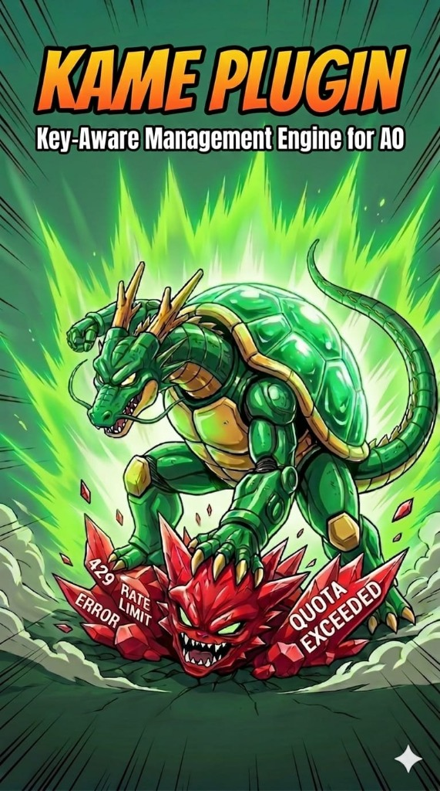
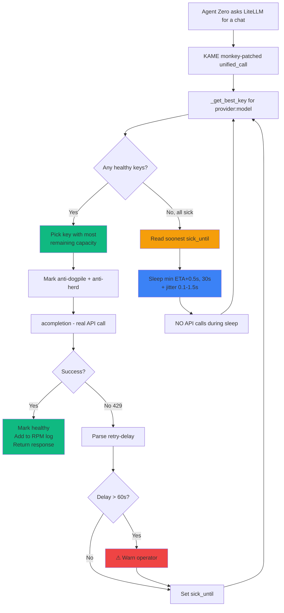

<div align="center">

# 🐢⚡ Key-Aware Management Engine ⚡🐢            (API Rotation Plugin) for Agent Zero

### KAME — the learning carousel that keeps your AI agent alive

[](https://github.com/Kame696/kame-api-engine/releases)
[](LICENSE)
[](https://github.com/frdel/agent-zero)
[](https://www.python.org/)
[](#-production-validation-real-log-may-2026)
[](https://github.com/Kame696/kame-api-engine/stargazers)

---

### ❤️ Support the project

If KAME saved you from a rate-limit hell, consider a tip:

**Bitcoin** — `36BGYhMEVFgY8PLGMVux93pjGt92KVM6dJ`

*Every sat helps me keep this project alive and learning.*

---



### *4P1 R0T4T10N — 4FRE3D0M*

</div>

---

## 🎯 What is KAME?

**KAME is what API rotation should have been.**

Round-robin libraries cycle keys blindly. They keep banging on a key that just hit a 429 because they have no memory. They have no idea which key has capacity left. They retry through dead keys and call it "resilience."

KAME does the **opposite** of every assumption round-robin makes:

<table>
<tr>
<td width="50%" valign="top">

### 🧠 Learns from every 429

Parses the provider's own `retry-delay` from every error response and respects it **to the second**.

No guessing. No fixed backoff. KAME asks the API how long to wait — and waits exactly that long.

</td>
<td width="50%" valign="top">

### 🎯 Picks the right key, every time

A 60-second sliding window tracks each key's recent activity. KAME selects the key with the **most remaining capacity**, not just the next one in line.

LRU tie-break ensures even spreading across the pool.

</td>
</tr>
<tr>
<td width="50%" valign="top">

### 💤 Sleeps intelligently when keys cool

When the entire pool is temporarily exhausted, KAME reads the soonest recovery time and **sleeps until then** (capped at 30s) — instead of burning wasted 429 requests that prolong the cooldown.

Production-proven: **45 wasted requests in v0.5.7.x → 0 in v1.0.0.**

</td>
<td width="50%" valign="top">

### 🤝 Trusts the connection

**Zero artificial timeouts.** If the API accepts your request without error, KAME waits patiently for it to finish — even if it's a 90,000-token compression that takes 90 seconds.

No death-loops on slow models. No "timed out" crashes during legitimate work.

</td>
</tr>
<tr>
<td colspan="2" valign="top">

### 🥷 Stays invisible

Every wait includes `random.uniform(0.1, 1.5)` seconds of **jitter**. No two waits are identical. Anti-bot detection systems can't fingerprint KAME, and multi-client deployments never sync-collide on the same recovery moment.

KAME doesn't look like a bot. KAME looks like a thoughtful human who took a coffee break at exactly the right time.

</td>
</tr>
</table>

> **You give it a comma-separated list of API keys. It gives you an agent that never stops.**

---

## 📈 Production validation (real log, May 2026)

You don't have to take my word for it. Here's a single day of intensive Agent Zero usage:

| Metric | Value |
|---|---|
| KAME-managed operations | **1,163** |
| Rate limit (429) events encountered | **117** |
| Rate limits resolved by rotation alone | **116** (99.1%) |
| Pool-fully-sick events requiring sleep | **1** |
| False pulses (wasted retries against sick keys) | **0** |
| KAME engine crashes | **0** |
| Pool state "healthy" during operations | **~99%** |

The single sleep event tells the whole story:

- KAME predicted wake: **18:09:00**
- KAME actual wake: **18:09:00.291**
- Off by: **291 milliseconds** (the random jitter)
- After waking: picked the recovered key in **0.08ms**, request succeeded

> That's what production-validated means: **predictions accurate within the jitter window, zero crashes, zero wasted requests.**

---

## ⚡ Quick start (3 steps)

1. **Copy** the `api_rotation_by_kame/` folder into `/a0/usr/plugins/`
2. **In Agent Zero → Settings → Model Provider**, enter your keys separated by commas:
   `key1, key2, key3, key4, ...`
3. **Restart Agent Zero.** That's it.

No config required. No tuning. No code changes anywhere. The plugin monkey-patches Agent Zero's LiteLLM layer at boot and reverts cleanly on uninstall.

Look for this banner on startup:

```
=======================================================
  🐢⚡ KAME v1.0.0 — ACTIVE
  ✓ Identity-Aware Health
  ✓ Eternal Carousel Rotation
  ✓ RPM-Aware Predictive Selection
  ✓ Anti-Dogpile Guard
  ✓ Anti-Thundering-Herd (Pending Counter)
  ✓ Trust the Connection (No Artificial Timeouts)
  ✓ KAME-Aware Compression Guard
  ✓ Hybrid Learning (Parsed retry-delay + ETA-driven sleep)
  ✓ Long-Delay Warning (>60s flagged for operator)
  ✓ Rate Limiter Lock Fix
  ✓ Token Callback Support
  ✓ Friendly Error Reporting
=======================================================
```

---

## 🆚 KAME vs Plain Round-Robin

| | Plain round-robin | **KAME** |
|---|---|---|
| Selection logic | "next in line" | **most remaining capacity** (RPM-aware predictive) |
| Behavior on 429 | retry same key with backoff | **read provider's `retry-delay`, sleep that exact time** |
| Concurrent calls | all dogpile on key #1 | **spread across keys** (anti-dogpile + anti-thundering-herd) |
| Sick key recovery | guessed (often wrong) | **respected to the second** (parsed from response) |
| Wasted 429 requests | many | **zero** |
| Detectable as bot | yes (regular spin) | **no** (jitter on every wait) |
| Long-delay handling | crashes or spins forever | **gracefully sleeps + warns operator** |
| Compression flow | breaks on token limit | **rotates mid-compression**, finishes anyway |
| Memory of failures | none | **identity-aware health** (per `provider:model`) |
| Recovery from "all sick" pool | infinite retry, kills your quota | **ETA-driven sleep, wake exactly on time** |

> If you're using round-robin, your keys are spending half their quota proving they're still rate-limited. With KAME, every request that hits the API actually gets answered.

---

## 🛡️ The 12 Shields

| # | Shield | What it gives you |
|---|---|---|
| 1 | 🆔 **Identity-Aware Health** | Tracks key health per `provider:model` pair. Your `gemini-2.5-flash` pool is separate from your `gemini-2.5-pro` pool — a 429 on one doesn't disable the other. |
| 2 | 🔄 **Eternal Carousel** | Infinite rotation. Never gives up, never crashes. Survives any combination of failures. |
| 3 | 📊 **RPM-Aware Predictive Selection** | 60-second sliding window per key. Picks the one with most remaining capacity. LRU tie-break for even spreading. |
| 4 | 🛡️ **Anti-Dogpile Guard** | At selection, the chosen key is marked busy NOW. Concurrent calls naturally pick different keys. |
| 5 | 🐎 **Anti-Thundering-Herd** | The pending request counts in the 60s window BEFORE it completes, so other threads route around it. |
| 6 | 💤 **ETA-Driven Sleep** | When all keys are sick, sleep until the soonest recovery (capped 30s). Re-select after waking. **Never call the API with a sick key.** |
| 7 | 🎲 **Smart Hybrid Jitter** | `random.uniform(0.1, 1.5)` seconds on every wait. Anti-bot-detection. Prevents multi-client sync collisions. |
| 8 | 🤝 **Trust the Connection** | **Zero artificial timeouts.** Slow legitimate work runs to completion. |
| 9 | 📦 **KAME-Powered Compression** | History compression goes through the same eternal carousel. Multi-key rotation during summarization. |
| 10 | ⚠️ **Long-Delay Warning** | When a parsed retry-after exceeds 60s (likely daily quota), KAME warns the operator. Value still respected, capped at 1 hour. |
| 11 | 🔒 **Rate Limiter Deadlock Fix** | Replaces A0's `asyncio.Lock` with `threading.Lock`, eliminating an async deadlock under specific concurrency patterns. |
| 12 | 🧹 **Clean Uninstall** | `hooks.py::uninstall()` reverts every monkey-patch. Drop the folder and KAME is gone — no leftover state. |

---

## 🔬 How it works



The whole engine is **~800 lines in a single file** (`kame_engine.py`), monkey-patching `LiteLLMChatWrapper.unified_call`, `Topic.summarize_messages`, `Bulk.summarize`, and the framework's rate limiter.

<details>
<summary><b>📐 Click for technical deep-dive (state schema + selection algorithm)</b></summary>

### Per-key health state

Every API key carries this dictionary, scoped under `{provider}:{model}`:

```python
{
    "sick_until":    float,  # epoch time when key becomes available again
    "last_used":     float,  # for LRU tie-break + anti-dogpile
    "request_log":   [float],# 60s sliding window of request timestamps
    "last_sick_at":  float,  # for compression-aware "fresh recovery" filter
}
```

### Selection algorithm

```python
best_key = min(healthy, key=lambda k: (
    len(pool[k]["request_log"]),  # primary: most remaining 60s-window capacity
    pool[k]["last_used"],         # secondary: LRU for even spreading
))
# Then: mark used NOW (anti-dogpile)
#       count pending NOW in request_log (anti-thundering-herd)
```

In a 15-key pool firing 100 requests in 60 seconds, KAME spreads them roughly evenly (~6-7 per key) without you doing anything.

### ETA-driven sleep formula

```python
soonest_eta = min(sick_until - now  for each sick key)
if soonest_eta > 3.0:
    wait = min(soonest_eta + 0.5, 30.0) + random.uniform(0.1, 1.5)
else:
    wait = 2.0 + random.uniform(0.1, 1.5)  # fallback for very short ETAs
await asyncio.sleep(wait)
continue   # never fall through with a sick key
```

</details>

---

## 📊 Verbose mode (opt-in observability)

KAME ships clean by default. When you want to see exactly what's happening, flip one switch.

**Default (clean):**
```
[KAME] Chat|gemini-2.5-flash ➡ Calling...
[KAME] Chat|gemini-2.5-flash ✅ AIzaSyDo... (1 attempt)
```

**Verbose trace** (Settings → Plugins → KAME → ☑ Verbose trace mode):
```
[KAME] Chat|gemini-2.5-flash ➡ Calling...
[KAME] Chat|gemini-2.5-flash ➡ k0a770 picked in 0.08ms
[KAME] Chat|gemini-2.5-flash ✅ k0a770 in 2.4s | pool 15/15 healthy
```

**During a sleep cycle** (always visible, regardless of verbose mode):
```
[KAME] Chat|gemini-2.5-flash 💤 All keys cooling. Sleeping 7.7s (no API calls)
       - next key recovers in ~7s (wake at 18:09:00)
[KAME] Chat|gemini-2.5-flash ➡ k0a770 picked in 0.08ms
[KAME] Chat|gemini-2.5-flash ✅ k0a770 in 9.4s | pool 15/15 healthy | 5 rotations, 7.7s local wait
```

The sleep notification is **always visible**, so users never think the agent is stuck.

---

## ⚙️ Settings

| Setting | Default | Purpose |
|---|---|---|
| `verbose_trace` | `false` | Toggle the detailed log mode shown above. |

That's the only knob. Everything else is opinionated and validated in production — the algorithm, sleep timing, jitter range, 60s RPM window, and quarantine logic are all tuned and tested. If you really want to tweak, the code in `kame_engine.py` is well-commented.

---

## 🗑️ Uninstall

```bash
rm -rf /a0/usr/plugins/api_rotation_by_kame/
# Restart Agent Zero
```

KAME's `hooks.py::uninstall()` runs **BEFORE** deletion and reverts every monkey-patch. No leftover state.

---

## ❓ FAQ

<details>
<summary><b>I only have one API key. Does KAME help?</b></summary>

With one key, KAME is roughly equivalent to A0's native rate limiter. The eternal-carousel magic needs multiple keys. **Recommend 5+ for good RPM spreading.**
</details>

<details>
<summary><b>KAME picked the same key twice in a row. Bug?</b></summary>

Likely not. If you have only 2-3 keys and one just succeeded with fresh RPM capacity, RPM-aware selection may legitimately re-pick it. With more keys (10+), this becomes very rare due to anti-dogpile.
</details>

<details>
<summary><b>I'm seeing "Long retry delay parsed: 536s" — is this a bug?</b></summary>

No, it's a feature working correctly. The provider told KAME this specific key needs to wait 9 minutes — typically a daily quota reset. KAME respects it and surfaces the warning so you know.
</details>

<details>
<summary><b>Compression takes a long time. Is KAME slowing it down?</b></summary>

No. KAME's "Trust the Connection" philosophy means zero artificial timeouts. A 90,000-token compression that legitimately takes 90 seconds takes 90 seconds. Without KAME, A0's native flow can crash with "timed out" — KAME lets it finish.
</details>

<details>
<summary><b>Does verbose_trace cost extra API calls?</b></summary>

Zero. It's pure local instrumentation — just adds log lines.
</details>

<details>
<summary><b>Can I use KAME with Anthropic / OpenAI / others, not just Gemini?</b></summary>

Yes. KAME is provider-agnostic. It works wherever Agent Zero's LiteLLM layer works. The retry-delay parser handles Google, OpenAI, Anthropic, and generic HTTP `Retry-After` headers.
</details>

<details>
<summary><b>What if all my keys die permanently?</b></summary>

KAME keeps cycling. Auth errors (401) trigger a 1-hour quarantine for that key. If literally every key is dead, your agent sleeps 30s, wakes, tries again, sleeps 30s, etc., until you fix it. **No infinite spin against a wall.**
</details>

---

## 🔧 Compatibility

- **Agent Zero**: v1.14+ (verified through v1.15)
- **Python**: 3.10+
- **Providers**: any LiteLLM-supported provider (Google, OpenAI, Anthropic, Mistral, Groq, DeepSeek, xAI, Together, ...)
- **No new dependencies** — uses stdlib only on top of what A0 already ships

---

## 🤝 Contributing

PRs welcome. The engine is intentionally small (~800 LOC, single file). When proposing changes:

1. Keep the **engine algorithm** stable — selection, anti-dogpile, ETA-driven sleep are battle-tested.
2. Add features behind opt-in flags when possible (see `verbose_trace` as a pattern).
3. Log production behavior in `test_logs/` with version-named files so changes can be audited.

Bugs and feature requests via [GitHub issues](https://github.com/Kame696/kame-api-engine/issues).

---

## 📜 License

**MIT License** — see [`LICENSE`](LICENSE).

`Copyright (c) 2026 KAME (https://github.com/Kame696)`

You can use, modify, distribute, and even sell KAME with the only requirement being to keep the copyright notice. The author retains all rights to KAME as the original work; the license simply grants permissive usage to others.

---

## 🪪 Evolution

KAME has been in development since early 2026, learning from real production logs at every step:

| Version | Focus | Key insight |
|---|---|---|
| **v1.0.0** | First stable release | Engine validated: 1,163 ops / 117 rate limits / 0 crashes. ETA-driven sleep proven in production. |
| v0.5.8.0 | The ETA Fix | Real log revealed: pulsing every 2s against sick keys burned ~45 wasted 429s in 26s. Fixed by sleeping exactly until next recovery. |
| v0.5.7.4 | Verbose Trace | Added opt-in observability: key short id, selection latency, pool snapshot, cascade summary, compression-aware filter. |
| v0.5.7.3 | The Trust Restored | Rolled back a misattributed "bug fix" that was actually the production-validated dispersion brake. |
| v0.5.7 | Packaging Cleanup | A0 v1.15 schema compliance, clean uninstall hooks. |
| v0.5.6 | The Trust | "Trust the Connection" philosophy formalized — zero artificial timeouts. |
| v0.5.0 - v0.5.5 | The Commander → The Refined | Identity-aware health, anti-dogpile, anti-thundering-herd, smart quarantine. |
| v0.4.x | The Seed → The Strategist | Foundational rotation, eternal carousel, basic RPM-awareness. |

> **The lesson across versions:** the only way to build something this reliable is to **run it in production and read the logs honestly**. Every major improvement in KAME came from a real log showing real behavior — not from theory.

---

## 🎀 Credits & Star CTA

Built by [**KAME**](https://github.com/Kame696). Engine refinement guided by real production log analysis — including the v0.5.7.4 log that revealed the wasted-pulse bug fixed in v0.5.8.0. Special thanks to every 429 that taught KAME something new.

### ⭐ Star this repo

If KAME made your agent less frustrating, drop a star ⭐ — it costs you nothing and helps others find this.

[**Star Kame696/kame-api-engine on GitHub →**](https://github.com/Kame696/kame-api-engine/stargazers)

---

<div align="center">

🐢⚡ **KAME v1.0.0** — *because round-robin was never enough*

**Bitcoin** — `36BGYhMEVFgY8PLGMVux93pjGt92KVM6dJ`

*4P1 R0T4T10N — 4FRE3D0M*

</div>
