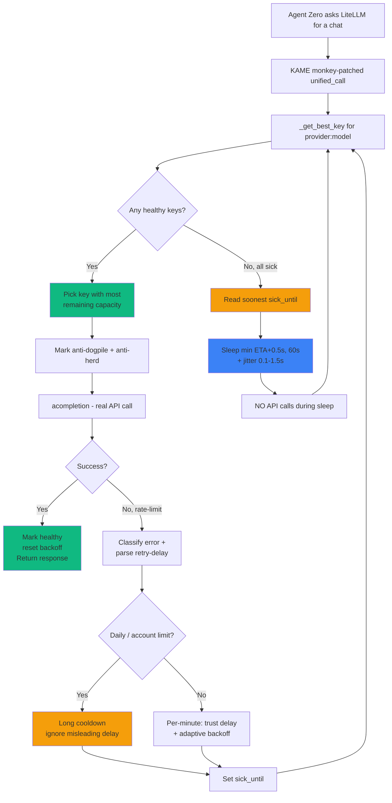

<div align="center">

# \\\ ~ 🐢⚡ Key-Aware Management Engine ⚡🐢 ~ // (API Rotation Plugin) for Agent Zero

### KAME API Rotation Engine — the learning carousel that keeps your AI agent alive

[](https://github.com/Kame696/kame-api-engine/releases)
[](LICENSE)
[](https://github.com/agent0ai/agent-zero)
[](https://www.python.org/)
[](#-production-validation-real-log-may-2026)
[](https://github.com/Kame696/kame-api-engine/stargazers)


### *4P1 R0T4T10N — 4FRE3D0M*

</div>

---

## 🎯 What is KAME?

**KAME is what API rotation should have been.**

Round-robin libraries cycle keys blindly. They keep banging on a key that just hit a 429 because they have no memory. They have no idea which key has capacity left. They retry through dead keys and call it "resilience."

KAME does the **opposite** of every assumption round-robin makes:

<table>
<tr>
<td width="50%" valign="top">

### 🧠 Learns from every 429

Parses the provider's own `retry-delay` and respects it **to the second** on per-minute limits. On a **daily quota** it knows not to trust a misleadingly short delay — it cools that key for a real cooldown instead.

No guessing. No fixed backoff. Per-minute or daily, on any provider, KAME does the right thing.

</td>
<td width="50%" valign="top">

### 🎯 Picks the right key, every time

A 60-second sliding window tracks each key's recent activity. KAME selects the key with the **most remaining capacity**, not just the next one in line.

LRU tie-break ensures even spreading across the pool.

</td>
</tr>
<tr>
<td width="50%" valign="top">

### 💤 Sleeps intelligently when keys cool

When the entire pool is temporarily exhausted, KAME reads the soonest recovery time and **sleeps until then** (capped at 60s, re-checking after) — instead of burning wasted 429 requests that prolong the cooldown.

Production-proven: **45 wasted requests in v0.5.7.x → 0 in v1.0.0.**

</td>
<td width="50%" valign="top">

### 🤝 Trusts the connection

**Zero artificial timeouts.** If the API accepts your request without error, KAME waits patiently for it to finish — even if it's a 90,000-token compression that takes 90 seconds.

No death-loops on slow models. No "timed out" crashes during legitimate work.

</td>
</tr>
<tr>
<td colspan="2" valign="top">

### 🥷 Stays invisible

Every wait includes `random.uniform(0.1, 1.5)` seconds of **jitter**. No two waits are identical. Anti-bot detection systems can't fingerprint KAME, and multi-client deployments never sync-collide on the same recovery moment.

KAME doesn't look like a bot. KAME looks like a thoughtful human who took a coffee break at exactly the right time.

</td>
</tr>
</table>

> **You give it a comma-separated list of API keys. It gives you an agent that never stops.**

---

## ⚡ Install — Quick start (3 steps)

1. **Copy** the `api_rotation_by_kame/` folder into `/a0/usr/plugins/`
2. **In Agent Zero → Settings → Model Provider**, enter your keys separated by commas:
   `key1, key2, key3, key4, ...`
3. **Restart Agent Zero.** That's it.

No config required. No tuning. No code changes anywhere. The plugin hooks Agent Zero's model layer at boot and reverts cleanly on uninstall.

> **Agent Zero v1.x *and* V2 are both supported.** v1.0.4 auto-detects which model-streaming layer your A0 build uses (the classic `acompletion` path on v1.x, or the new transport layer on V2) and adapts — the rotation engine is identical on both. Nothing for you to configure.

Look for this banner on startup:

```
=======================================================
  🐢⚡ KAME v1.0.4 — ACTIVE
  ✓ Identity-Aware Health
  ✓ Eternal Carousel Rotation
  ✓ RPM-Aware Predictive Selection
  ✓ Anti-Dogpile Guard
  ✓ Anti-Thundering-Herd (Pending Counter)
  ✓ Trust the Connection (No Artificial Timeouts)
  ✓ KAME-Aware Compression Guard
  ✓ Hybrid Learning (Parsed retry-delay + ETA-driven sleep)
  ✓ Daily-Quota & Account-Limit Aware (multi-provider)
  ✓ Adaptive Backoff (provider-agnostic safety net)
  ✓ Rate Limiter Lock Fix
  ✓ Token Callback Support
  ✓ Friendly Error Reporting (real status + kind)
  Note: keys are shown as anonymized ids (e.g. 'k3f9a1') — NOT your real keys.
=======================================================
```

---

## ⚙️ Settings

| Setting | Default | Purpose |
|---|---|---|
| `kame_log_level` | `normal` | How much KAME writes to the log: `silent` (nothing but hard errors), `normal` (one line per success + events; pool count only when degraded), or `verbose` (full diagnostics). A legacy `verbose_trace: true` still maps to `verbose`. |
| `daily_quota_cooldown_seconds` | `3600` | How long to rest a key after a **daily-quota / out-of-credit** error (any provider). Also the adaptive-backoff ceiling. Clamped 1–86400. |
| `key_log_style` | `fingerprint` | How keys appear in logs: `fingerprint` (anonymized id, never leaks the secret), `prefix8` (first 8 chars), or `full` (debug only). |
| `kame_collapse_storm_logs` | `true` | Collapse a repetitive 503/error **storm** at `normal` level into one aggregate line every ~20s (+ a "storm over" recap) instead of hundreds of identical warnings. `verbose` always prints every line. Pure logging. (v1.0.3) |
| `kame_log_full_errors` | `false` | Debug escape hatch: ALSO print the **raw** exception (type, status, retry attrs, full body) beside KAME's classification, so you can verify there's no misclassification. Independent of `kame_log_level`; overrides the storm collapse (shows every line). (v1.0.3) |

Everything else is opinionated and validated in production — the algorithm, sleep timing, jitter range, 60s RPM window, and quarantine logic are all tuned and tested. If you really want to tweak, the code in `kame_engine.py` is well-commented.

---

## 📊 Logging (silent / normal / verbose)

KAME explains itself in plain language. One setting — `kame_log_level` — controls how much it writes to the Docker log. **The rotation algorithm is identical at every level; this only changes what you see.** Change it in **Settings → Plugins → KAME → Log level**; it takes effect on the next monologue start (no restart).

### `normal` (default) — success is never silent

One compact line per **successful** call, plus rotations, limit hits, sleeps and errors. Keys appear as anonymized fingerprints (configurable via `key_log_style`). The pool-health count shows **only when the pool is degraded**, so a healthy pool stays quiet:

```
[KAME] Chat|gemini-2.5-flash ✅ k0a770
```

When a key hits a limit, KAME tells you the **real reason** (v1.0.1, any provider) and rotates — then the success line says, in plain words, how many rotations it took (no more cryptic "3 attempts"):

```
[KAME] Chat|gemini-2.5-flash k0a770 ⏳ 429 per-minute → wait 37s · next key...
[KAME] Chat|gemini-2.5-flash ✅ k1b8c2 · 1 rotation · pool 14/15 healthy
```

A daily-quota or out-of-credit key is rested for a real cooldown instead of being hammered once per second:

```
[KAME] Chat|gemini-2.5-flash k1b8c2 ⏳ 429 daily-quota → cooling 1h · next key...
[KAME] Chat|gemini-2.5-flash ✅ k2c9d4 · 1 rotation · pool 13/15 healthy
```

### `verbose` — full diagnostics

Everything in `normal`, plus a `Calling...` heartbeat, the picked-key line, per-call wall time, the **full** pool snapshot on every success, a cascade breakdown, and a periodic session summary. Best while tuning the key pool or when you suspect KAME is the bottleneck and want to prove it isn't:

```
[KAME] Chat|gemini-2.5-flash ➡ Calling...
[KAME] Chat|gemini-2.5-flash ➡ k0a770 picked in 0.08ms
[KAME] Chat|gemini-2.5-flash ✅ k0a770 in 2.4s | pool 15/15 healthy
```

After a cascade across several keys (with a sleep in the middle):

```
[KAME] Chat|gemini-2.5-flash ✅ k2c9d4 in 9.4s | pool 13/15 healthy | 5 rotations, 1 sleep
```

### `silent` — the documented exception

KAME stays out of the log entirely: no banner, no per-call line, no rotation or sleep notices. Only a **hard, unrecoverable error** still surfaces. Internal stats and key health are still tracked — only the log output is suppressed. Use it when you want the plugin to be invisible in the Docker log for fully unattended runs.

### Sleep is always visible (except in `silent`)

When the whole pool is cooling, KAME never goes dark without telling you. Near a recovery it logs each cycle (throttled); on a long outage it announces the **real** earliest-recovery time, then keeps a heartbeat (~every 5 min) so you never mistake a healthy cooldown for a hang:

```
[KAME] Chat|gemini-2.5-flash 💤 All keys cooling. Sleeping 7.7s (no API calls) — earliest recovery ~7s.
```
```
[KAME] Chat|gemini-2.5-flash 💤 All keys cooling — earliest recovery in ~1h (around 19:05:00). Re-checking every ~60s, no API calls.
```

> The clock shown is the **true** earliest recovery (not the next 60s re-check), and the sleep is **interruptible** — a message or *nudge* during a cooldown is honored immediately (v1.0.2). So you never mistake a healthy cooldown for a hang.

---

## 🆚 KAME vs Plain Round-Robin

| | Plain round-robin | **KAME** |
|---|---|---|
| Selection logic | "next in line" | **most remaining capacity** (RPM-aware predictive) |
| Behavior on 429 | retry same key with backoff | **read provider's `retry-delay`, sleep that exact time** |
| Concurrent calls | all dogpile on key #1 | **spread across keys** (anti-dogpile + anti-thundering-herd) |
| Sick key recovery | guessed (often wrong) | **respected to the second** (parsed from response) |
| Wasted 429 requests | many | **zero** |
| Detectable as bot | yes (regular spin) | **no** (jitter on every wait) |
| Daily-quota / out-of-credit key | trusts a misleading short retry, hammers a dead key | **detected → real cooldown, any provider** |
| Compression flow | breaks on token limit | **rotates mid-compression**, finishes anyway |
| Memory of failures | none | **identity-aware health** (per `provider:model`) |
| Recovery from "all sick" pool | infinite retry, kills your quota | **ETA-driven sleep, wake exactly on time** |

> If you're using round-robin, your keys are spending half their quota proving they're still rate-limited. With KAME, every request that hits the API actually gets answered.

---

## 🛡️ The 13 Shields

| # | Shield | What it gives you |
|---|---|---|
| 1 | 🆔 **Identity-Aware Health** | Tracks key health per `provider:model` pair. Your `gemini-2.5-flash` pool is separate from your `gemini-2.5-pro` pool — a 429 on one doesn't disable the other. |
| 2 | 🔄 **Eternal Carousel** | Infinite rotation. Never gives up, never crashes. Survives any combination of failures. |
| 3 | 📊 **RPM-Aware Predictive Selection** | 60-second sliding window per key. Picks the one with most remaining capacity. LRU tie-break for even spreading. |
| 4 | 🛡️ **Anti-Dogpile Guard** | At selection, the chosen key is marked busy NOW. Concurrent calls naturally pick different keys. |
| 5 | 🐎 **Anti-Thundering-Herd** | The pending request counts in the 60s window BEFORE it completes, so other threads route around it. |
| 6 | 💤 **ETA-Driven Sleep** | When all keys are sick, sleep until the soonest recovery (capped 60s, then re-check). Re-select after waking. **Never call the API with a sick key.** |
| 7 | 🎲 **Smart Hybrid Jitter** | `random.uniform(0.1, 1.5)` seconds on every wait. Anti-bot-detection. Prevents multi-client sync collisions. |
| 8 | 🤝 **Trust the Connection** | **Zero artificial timeouts.** Slow legitimate work runs to completion. |
| 9 | 📦 **KAME-Powered Compression** | History compression goes through the same eternal carousel. Multi-key rotation during summarization. |
| 10 | 📅 **Daily-Quota & Account-Limit Aware** | Detects daily-quota and out-of-credit (`insufficient_quota`) errors across providers and applies a real cooldown — instead of trusting a misleadingly short retry and hammering a dead key once per second. Configurable (`daily_quota_cooldown_seconds`, default 1h). |
| 11 | 📈 **Adaptive Backoff** | Provider-agnostic safety net: if the same key keeps hitting rate limits, its cooldown escalates (20s → 40s → 80s … up to the ceiling) and resets on the first success. Kills re-probe bursts even when the provider strips all error details. |
| 12 | 🔒 **Rate Limiter Deadlock Fix** | Replaces A0's `asyncio.Lock` with `threading.Lock`, eliminating an async deadlock under specific concurrency patterns. |
| 13 | 🧹 **Clean Uninstall** | `hooks.py::uninstall()` reverts every monkey-patch. Drop the folder and KAME is gone — no leftover state. |

---

## 🔬 How it works



The whole engine is a single file (`kame_engine.py`), monkey-patching `LiteLLMChatWrapper.unified_call`, `Topic.summarize_messages`, `Bulk.summarize`, and the framework's rate limiter. **v1.0.4** makes the per-attempt connect + chunk-parse version-aware so the same engine works on Agent Zero v1.x (the `acompletion` path) and Agent Zero V2 (the `LiteLLMTransport` layer); the selection / health / cooldown carousel is unchanged on both.

<details>
<summary><b>📐 Click for technical deep-dive (state schema + selection algorithm)</b></summary>

### Per-key health state

Every API key carries this dictionary, scoped under `{provider}:{model}`:

```python
{
    "sick_until":    float,  # epoch time when key becomes available again
    "last_used":     float,  # for LRU tie-break + anti-dogpile
    "request_log":   [float],# 60s sliding window of request timestamps
    "last_sick_at":  float,  # for compression-aware "fresh recovery" filter
    "consecutive_rl":int,    # consecutive rate-limit fails -> adaptive backoff (resets on success)
}
```

### Selection algorithm

```python
best_key = min(healthy, key=lambda k: (
    len(pool[k]["request_log"]),  # primary: most remaining 60s-window capacity
    pool[k]["last_used"],         # secondary: LRU for even spreading
))
# Then: mark used NOW (anti-dogpile)
#       count pending NOW in request_log (anti-thundering-herd)
```

In a 15-key pool firing 100 requests in 60 seconds, KAME spreads them roughly evenly (~6-7 per key) without you doing anything.

### ETA-driven sleep formula

```python
soonest_eta = min(sick_until - now  for each sick key)
if soonest_eta > 3.0:
    wait = min(soonest_eta + 0.5, 60.0) + random.uniform(0.1, 1.5)
else:
    wait = 2.0 + random.uniform(0.1, 1.5)  # fallback for very short ETAs
await asyncio.sleep(wait)
continue   # never fall through with a sick key
```

</details>

---

## 🗑️ Uninstall

```bash
rm -rf /a0/usr/plugins/api_rotation_by_kame/
# Restart Agent Zero
```

KAME's `hooks.py::uninstall()` runs **BEFORE** deletion and reverts every monkey-patch. No leftover state.

---

## ❓ FAQ

<details>
<summary><b>Do I need to restart Agent Zero after installing KAME?</b></summary>

No. A0 hot-reloads plugins: dropping KAME into your plugins folder (or toggling it on) clears the plugin/extension caches, and KAME activates on the **next agent turn** — no container restart, no framework restart, and it triggers no "reload the page" prompt (KAME ships no `extensions/webui`). The only prerequisite is having **multiple API keys** configured in A0's normal model settings — KAME never stores keys itself; it rotates the ones A0 already has.
</details>

<details>
<summary><b>Does KAME work on the new Agent Zero V2?</b></summary>

Yes, as of **v1.0.4**. Agent Zero V2 refactored its model streaming into a new transport layer and removed an internal function (`models._parse_chunk`) that KAME 1.0.3 imported on every call — so on V2, 1.0.3 loaded and printed "ACTIVE" but then failed every request. v1.0.4 detects the A0 version once and uses the new `LiteLLMTransport` on V2 or the classic `acompletion` path on v1.x. **One plugin, both A0 majors**, and the behavior on v1.x is identical to 1.0.3. If you're on V2, just install 1.0.4.
</details>

<details>
<summary><b>I only have one API key. Does KAME help?</b></summary>

With one key, KAME is roughly equivalent to A0's native rate limiter. The eternal-carousel magic needs multiple keys. **Recommend 5+ for good RPM spreading.**
</details>

<details>
<summary><b>KAME picked the same key twice in a row. Bug?</b></summary>

Likely not. If you have only 2-3 keys and one just succeeded with fresh RPM capacity, RPM-aware selection may legitimately re-pick it. With more keys (10+), this becomes very rare due to anti-dogpile.
</details>

<details>
<summary><b>I'm seeing "429 daily-quota → cooling 1h" — is this a bug?</b></summary>

No — a **429** daily-quota line is the daily-quota shield working: KAME detected a daily or out-of-credit limit and is resting that key for a real cooldown (default 1h, set by `daily_quota_cooldown_seconds`) instead of trusting a misleadingly short retry and hammering a dead key once per second. Your other keys keep working; the rested key is re-tried after the cooldown. (As of **v1.0.2**, a **5xx** server error — e.g. a transient Gemini `503` — is always treated as a short `server-busy` retry, *never* a daily quota, even if its body mentions "quota" — so a server blip can't cool a healthy key for an hour.)
</details>

<details>
<summary><b>Compression takes a long time. Is KAME slowing it down?</b></summary>

No. KAME's "Trust the Connection" philosophy means zero artificial timeouts. A 90,000-token compression that legitimately takes 90 seconds takes 90 seconds. Without KAME, A0's native flow can crash with "timed out" — KAME lets it finish.
</details>

<details>
<summary><b>Does verbose / debug logging cost extra API calls?</b></summary>

Zero. Every log level is pure local instrumentation — it only changes how many lines KAME prints, never how it calls the API. Even `silent` still tracks stats and key health internally; it just doesn't write them out.
</details>

<details>
<summary><b>During an outage my log used to fill with hundreds of "503 server-busy" lines. Still?</b></summary>

No — as of **v1.0.3**, at `normal` level KAME **collapses** a storm: it prints the first failure, then a single aggregate line every ~20s (`🌀 503 server-busy storm ×47 in 32s · pool 0/15 · earliest recovery ~1m30s …`), then a one-line **"storm over"** recap when a key answers again. You see that it's happening and how big it is, without the wall of identical warnings. Set `kame_collapse_storm_logs: false` (or use `verbose`) to get one line per failure again, or `kame_log_full_errors: true` to also dump every raw error. The rotation itself is unchanged — this is purely what reaches the log.
</details>

<details>
<summary><b>Can I use KAME with Anthropic / OpenAI / others, not just Gemini?</b></summary>

Yes. KAME is provider-agnostic. It works wherever Agent Zero's LiteLLM layer works. The retry-delay parser handles Google, OpenAI, Anthropic, Groq, and generic HTTP `Retry-After` headers — including compound durations like "6m 11.52s". v1.0.1's daily-quota detection and adaptive backoff are also multi-provider, so an exhausted daily key is handled correctly no matter who serves it.
</details>

<details>
<summary><b>What if all my keys die permanently?</b></summary>

KAME keeps cycling. Auth errors (401) and daily/account limits trigger a long cooldown (default 1h) for that key. If literally every key is dead, your agent sleeps (up to 60s per cycle), wakes, re-checks, and sleeps again until you fix it — announcing a long outage just once instead of spamming the log. **No infinite spin against a wall, no wasted API calls.**
</details>

---

## 🔧 Compatibility

- **Agent Zero**: v1.14+ through the v1.x line **and Agent Zero V2** (the transport-layer refactor) — v1.0.4 auto-detects which is installed and adapts.
- **Python**: 3.10+
- **Providers**: any LiteLLM-supported provider (Google, OpenAI, Anthropic, Mistral, Groq, DeepSeek, xAI, Together, ...)
- **No new dependencies** — uses stdlib only on top of what A0 already ships

---

## 🪪 Evolution (version history)

KAME has been in development since early 2026, learning from real production logs at every step:

| Version | Focus | Key insight |
|---|---|---|
| **v1.0.4** | Agent Zero V2 compatibility | A0 V2 refactored model streaming into a transport layer and **removed `models._parse_chunk`**, which KAME 1.0.3 imported on the first line of every patched call — so on V2 the patch still "installed" (printed ACTIVE) but every chat/utility call then raised `ImportError`. v1.0.4 detects the A0 version **once** and uses `helpers.litellm_transport.LiteLLMTransport` on V2 or the legacy `acompletion()+_parse_chunk` path on v1.x — **one engine, both A0 majors**. The rotation / health / cooldown carousel is byte-for-byte identical to 1.0.3 on v1.x; the only addition is stream-path auth/terminal awareness (on V2 the connect happens on the first transport chunk, so a bad-key error there is now quarantined+rotated rather than misclassified). |
| **v1.0.3** | Observability + faster recovery + invalid-key fix | Two real Gemini-`503` outages (15/16-06-2026, one **83 minutes straight**) proved the engine *handled* outages correctly — but the **logs** were hard to read and recovery **trickled**. Added: a raw full-error toggle (`kame_log_full_errors`) to verify each classification; **precise durations** (`1m30s`, not a rounded "2m"); **fast pool recovery** (`_thaw_server_cooled_keys` snaps the whole pool back on the first success after an outage instead of trickling over ~90s); **503-storm log collapse** (one aggregate line + a "storm over" recap instead of hundreds of identical warnings); and an **invalid-key fix** so an expired/typo'd **400** key (Gemini's `API_KEY_INVALID`) is quarantined + rotated instead of **aborting the whole run**. Selection path UNCHANGED — the happy path is identical to v1.0.2. |
| **v1.0.2** | Critical 5xx-misclassification fix + deeper nudge + honest waiting | A real ~6-hour Gemini run froze the chat ~38 min: transient `503`s whose bodies mentioned quota/daily were misclassified as a *daily* quota and cooled the whole pool for 1h. Fixed by classifying **any 5xx as a short `server` retry before** the quota-text check (a real daily quota is a 429, never a 5xx). Plus the *deeper* nudge fix — while the whole pool is cooling there's no stream to carry A0's intervention check, so the sleep is now **sliced and interruptible** (honors a message/nudge mid-cooldown); the long-outage line shows the **true** recovery clock + a heartbeat instead of a misleading "retry around" then silence; and per-minute backoff got its own lower ceiling so a busy RPM key is never over-cooled toward 1h. Engine selection path unchanged. |
| **v1.0.1** | Quota awareness + reliability fixes + log overhaul | Google sends a misleading `retryDelay: 1s` on a *daily* 429 — trusting it re-probed a dead key once per second. Fixed with strict daily/account detection + a provider-agnostic adaptive backoff, plus honest per-call error reporting. Three reliability fixes: a mid-run chat message sent **while a response is streaming** is received without pressing *nudge agent* (KAME stopped swallowing A0's `InterventionException`) — extended in v1.0.2 to also cover the all-keys-cooling sleep; a stream that fails after emitting content no longer re-generates from scratch on another key (`got_any_chunk` guard, mirroring vanilla A0); and a sustained `503 server-busy` outage on a big pool now escalates gently instead of spinning forever. The logs were reworked into a clear `silent`/`normal`/`verbose` tri-state with self-explanatory wording (no more cryptic "N attempts"). Engine selection path unchanged. |
| **v1.0.0** | First stable release | Engine validated: 1,163 ops / 117 rate limits / 0 crashes. ETA-driven sleep proven in production. |
| v0.5.8.0 | The ETA Fix | Real log revealed: pulsing every 2s against sick keys burned ~45 wasted 429s in 26s. Fixed by sleeping exactly until next recovery. |
| v0.5.7.4 | Verbose Trace | Added opt-in observability: key short id, selection latency, pool snapshot, cascade summary, compression-aware filter. |
| v0.5.7.3 | The Trust Restored | Rolled back a misattributed "bug fix" that was actually the production-validated dispersion brake. |
| v0.5.7 | Packaging Cleanup | A0 v1.15 schema compliance, clean uninstall hooks. |
| v0.5.6 | The Trust | "Trust the Connection" philosophy formalized — zero artificial timeouts. |
| v0.5.0 - v0.5.5 | The Commander → The Refined | Identity-aware health, anti-dogpile, anti-thundering-herd, smart quarantine. |
| v0.4.x | The Seed → The Strategist | Foundational rotation, eternal carousel, basic RPM-awareness. |

> **The lesson across versions:** the only way to build something this reliable is to **run it in production and read the logs honestly**. Every major improvement in KAME came from a real log showing real behavior — not from theory.

---

## 📈 Production validation (real log, May 2026)

You don't have to take my word for it. Here's a single day of intensive Agent Zero usage:

| Metric | Value |
|---|---|
| KAME-managed operations | **1,163** |
| Rate limit (429) events encountered | **117** |
| Rate limits resolved by rotation alone | **116** (99.1%) |
| Pool-fully-sick events requiring sleep | **1** |
| False pulses (wasted retries against sick keys) | **0** |
| KAME engine crashes | **0** |
| Pool state "healthy" during operations | **~99%** |

The single sleep event tells the whole story:

- KAME predicted wake: **18:09:00**
- KAME actual wake: **18:09:00.291**
- Off by: **291 milliseconds** (the random jitter)
- After waking: picked the recovered key in **0.08ms**, request succeeded

> That's what production-validated means: **predictions accurate within the jitter window, zero crashes, zero wasted requests.**

### v1.0.1 update — surviving a daily-quota storm (May 29, 2026)

A second real-world run, on a **15-key Gemini pool**, hit the exact failure mode v1.0.1 was built for: a wave of *daily*-quota exhaustion that eventually took the **entire pool cold** at once. Here is KAME's own session summary at the 100-operation mark:

```
[KAME] Session: 100 ok · 15 limited (min 0, daily 15, quota 0) · 1 long-sleep · 11 server · 0 timeout · 0 auth · 0 other
```

| Metric | Value |
|---|---|
| Operations completed | **100** |
| Rate limits classified as *daily* (correctly) | **15 / 15** — the v1.0.1 fix |
| Rate limits mis-classified as per-minute (the v1.0.0 bug) | **0** |
| Auth / timeout / unknown errors | **0** |
| KAME engine crashes | **0** |

When all 15 keys went cold, KAME announced the outage **once**, then slept quietly (no API calls) and woke within seconds of the first recovery:

- Announced once: *"All keys cooling — next recovery in ~17m … retry around 06:32:23."*
- Then ETA-sleeps only: *"Sleeping 17.8s … next key in ~16s"* → woke and picked the recovered key in **0.16ms**.

And the eternal carousel never gave up. The single hardest call rode out the whole storm and **still returned a successful response**:

- One `unified_call`: **2154.1s** wall time · **9 rotations** · **18 sleeps** · **1049s** of local waiting · ✅ success.
- The pool then recovered all the way back to **15/15 healthy** and stayed there for the rest of the ~6-hour session.

> v1.0.0 would have trusted the provider's misleading short `retryDelay` on those daily 429/503s and re-probed dead keys roughly once per second for hours. v1.0.1 rested each one for a real hour, slept through the total outage, and lost **zero** requests.

---

## ❤️ Support the project

If KAME saved you from a rate-limit hell, consider a tip:

**Bitcoin** — `36BGYhMEVFgY8PLGMVux93pjGt92KVM6dJ`

*Every sat helps me keep this project alive and learning.*

---

## 🤝 Contributing

PRs welcome. The engine is intentionally small (single file). When proposing changes:

1. Keep the **engine algorithm** stable — selection, anti-dogpile, ETA-driven sleep are battle-tested.
2. Add features behind opt-in settings when possible (see `kame_log_level` / `key_log_style` as a pattern).
3. Log production behavior in `test_logs/` with version-named files so changes can be audited.

Bugs and feature requests via [GitHub issues](https://github.com/Kame696/kame-api-engine/issues).

---

## 📜 License

**MIT License** — see [`LICENSE`](LICENSE).

`Copyright (c) 2026 KAME (https://github.com/Kame696)`

You can use, modify, distribute, and even sell KAME with the only requirement being to keep the copyright notice. The author retains all rights to KAME as the original work; the license simply grants permissive usage to others.

---

## 🎀 Credits & Star CTA

Built by [**KAME**](https://github.com/Kame696). Engine refinement guided by real production log analysis — including the v0.5.7.4 log that revealed the wasted-pulse bug fixed in v0.5.8.0. Special thanks to every 429 that taught KAME something new.

### ⭐ Star this repo

If KAME made your agent less frustrating, drop a star ⭐ — it costs you nothing and helps others find this.

[**Star Kame696/kame-api-engine on GitHub →**](https://github.com/Kame696/kame-api-engine/stargazers)

---

<div align="center">

🐢⚡ **KAME v1.0.4** — *because round-robin was never enough*

**Bitcoin** — `36BGYhMEVFgY8PLGMVux93pjGt92KVM6dJ`

*4P1 R0T4T10N — 4FRE3D0M*

</div>
